# Ownership and Lifecycle Flow

> **Scope:** current working tree based on commit `298355d` on `master`,
> inspected June 21, 2026. This document describes what the code does now. Future worker,
> daemon, PAM, forwarding, and policy plans are called out explicitly and are
> not presented as implemented behavior.

This report traces ownership of sockets, encrypted framing, authentication
decisions, sessions, channels, command protocol instances, file descriptors,
terminals, and child processes. It also inventories the goroutines and
communication structures that make those lifetimes work.

## Executive summary

The central ownership rule is a baton pass:

```text
app dial/accept
  -> establish runtime
  -> Noise transport
  -> authenticated session
  -> command channel
  -> command protocol
  -> process group
```

The first three entries share one underlying TCP connection. Ownership moves
from the raw `net.Conn`, to `transport.Transport`, and finally to
`session.Session`. The command channel and process do not own the network
connection; their contexts are descendants of it and cancellation flows
downward.

The most important current properties are:

- the server withholds auth success until account/key authorization, immutable
  credentials, service registration, and session preparation/binding succeed;
- session workers are created while inert and only begin I/O after explicit
  activation;
- one session receiver owns post-auth reads and one writer owns post-auth
  writes;
- service callbacks never run in the receive loop;
- each active channel has one event worker;
- the command protocol has one client receive loop and serialized writes on
  both peers;
- the process runner owns `cmd.Wait`, process-group termination, descriptors,
  and the final exit result;
- terminal orchestrators use one-shot state or `sync.Once`, and repeated
  cleanup calls are tolerated where composition requires them.

The most important current lifecycle limitations are:

- the server accepts exactly one connection and exits when it finishes;
- a session write whose writer has already started cannot be interrupted by
  the caller's context;
- abrupt session completion does not directly join the separately spawned
  command-service and process cleanup goroutines;
- the root shutdown stack currently owns logging only; network and process
  cleanup relies on context propagation in the command path;
- the entire post-auth service and child-process runtime remains in the same
  process as the listener, host key, and authorization code.

---

## 1. Dependency topology

### 1.1 Application and library dependency graph

Arrows mean “imports or directly composes.”

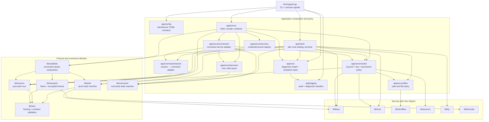
```mermaid
flowchart TD
    BIN["bin/mygosh.go<br/>CLI + process signals"]

    subgraph APP["Application composition and policy"]
        CONFIG["app/config<br/>client/server TOML contracts"]
        LOGGING["app/logging<br/>audit + diagnostic handlers"]
        ROOT["app/root<br/>diagnostic install + shutdown stack"]
        CLIENT["app/client<br/>dial, trust loading, terminal"]
        SERVER["app/server<br/>listen, accept, compose"]
        SECUREFILES["app/securefiles<br/>path and file policy"]
        AUTHZ["app/server/authz<br/>account + key + permission policy"]
        SERVICES["app/server/services<br/>credential-bound registry"]
        SERVERCMD["app/server/command<br/>command service adapter"]
        PROCESS["app/server/process<br/>Unix child owner"]
        CMDCH["app/commandchannel<br/>session ↔ command adapter"]
    end

    subgraph PROTOCOL["Protocol and connection libraries"]
        EST["lib/establish<br/>connection phase composition"]
        TRANSPORT["lib/transport<br/>Noise + encrypted frames"]
        WIRE["lib/wire<br/>framing + protobuf validation"]
        AUTH["lib/auth<br/>proof state machine"]
        SESSION["lib/session<br/>post-auth mux"]
        COMMAND["lib/command<br/>command state machine"]
    end

    subgraph SECURITY["Security and Unix helpers"]
        KEYS["lib/keys"]
        TRUST["lib/trust"]
        STRICT["lib/strictfiles"]
        ACCOUNT["lib/account"]
        TTY["lib/tty"]
        BINCODER["lib/bincoder"]
    end

    BIN --> CONFIG
    BIN --> LOGGING
    BIN --> ROOT
    BIN --> CLIENT
    BIN --> SERVER

    ROOT --> LOGGING

    CLIENT --> ROOT
    CLIENT --> EST
    CLIENT --> AUTH
    CLIENT --> COMMAND
    CLIENT --> CMDCH
    CLIENT --> TTY
    CLIENT --> SECUREFILES
    CLIENT --> TRUST
    CLIENT --> KEYS

    SERVER --> ROOT
    SERVER --> EST
    SERVER --> SESSION
    SERVER --> AUTHZ
    SERVER --> SERVICES
    SERVER --> SERVERCMD
    SERVER --> PROCESS

    AUTHZ --> ACCOUNT
    AUTHZ --> AUTH
    AUTHZ --> SECUREFILES
    AUTHZ --> TRUST
    AUTHZ --> KEYS

    SERVICES --> AUTHZ
    SERVICES --> SESSION

    SERVERCMD --> AUTHZ
    SERVERCMD --> PROCESS
    SERVERCMD --> COMMAND
    SERVERCMD --> SESSION
    SERVERCMD --> CMDCH

    PROCESS --> COMMAND
    CMDCH --> SESSION
    SECUREFILES --> STRICT

    EST --> TRANSPORT
    EST --> AUTH
    EST --> SESSION
    AUTH --> WIRE
    AUTH --> KEYS
    SESSION --> WIRE
    TRANSPORT --> WIRE
    TRANSPORT --> BINCODER
```

The principal boundary is healthy: protocol packages do not import account,
trust-path, or process-policy packages. Application code performs the joins.
The deliberate bridge between the two post-auth protocols is
[`app/commandchannel`](app/commandchannel/conn.go), the only package that knows
both `session.Channel` and `command.FrameConn`.

### 1.2 Logging ownership

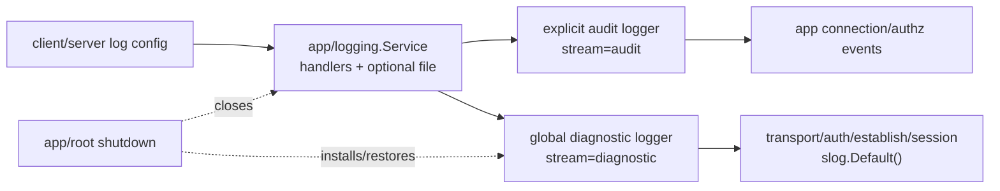
```mermaid
flowchart LR
    CFG["client/server log config"]
    SERVICE["app/logging.Service<br/>handlers + optional file"]
    AUDIT["explicit audit logger<br/>stream=audit"]
    DIAG["global diagnostic logger<br/>stream=diagnostic"]
    APP["app connection/authz events"]
    LIB["transport/auth/establish/session<br/>slog.Default()"]
    ROOT["app/root shutdown"]

    CFG --> SERVICE
    SERVICE --> AUDIT --> APP
    SERVICE --> DIAG --> LIB
    ROOT -. installs/restores .-> DIAG
    ROOT -. closes .-> SERVICE
```

The application owns levels, formatting, outputs, optional files, and logger
lifecycle. Security/audit outcomes receive an explicitly passed logger.
Libraries receive no logger configuration and emit lifecycle diagnostics
through the process-wide `slog.Default()` installed by `app/root`.

### 1.3 Wire layering

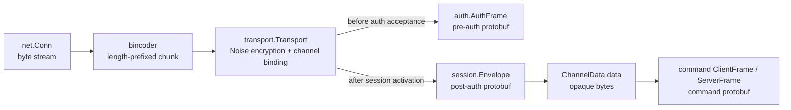
```mermaid
flowchart LR
    TCP["net.Conn<br/>byte stream"]
    LEN["bincoder<br/>length-prefixed chunk"]
    NOISE["transport.Transport<br/>Noise encryption + channel binding"]
    AUTHF["auth.AuthFrame<br/>pre-auth protobuf"]
    SESSF["session.Envelope<br/>post-auth protobuf"]
    CHDATA["ChannelData.data<br/>opaque bytes"]
    CMDF["command ClientFrame / ServerFrame<br/>command protobuf"]

    TCP --> LEN --> NOISE
    NOISE -->|before auth acceptance| AUTHF
    NOISE -->|after session activation| SESSF
    SESSF --> CHDATA --> CMDF
```

Auth and session frames never share a schema. The transition is coordinated by
`lib/establish`, which prevents the post-auth receiver from running until the
auth exchange is committed.

---

## 2. Ownership ledger

| Resource | Initial owner | Transfer or derived owner | Terminal action |
|---|---|---|---|
| Process signal context | `main` | parent of client/server work | `stop()` unregisters signal notification |
| Typed client/server settings | command-specific Cobra `RunE` | passed explicitly into client/server composition | ordinary Go lifetime |
| Optional log file | `logging.Service` | registered in root shutdown stack | `Service.Close`, once |
| Listener | `app/server.RunServer` | never transferred | context callback or deferred `Close` |
| Dialed/accepted TCP connection | `app/client` or `app/server` | consumed by `establish.runtime` | current establishment owner closes it |
| Noise cipher state and framed transport | `transport.Transport` | owned first by establishment, then session | `Transport.Close` closes TCP connection |
| Pending server auth decision | `auth.PendingServerAuth` | wrapped by `establish.PendingServer` | exactly one `Accept` or `Reject` attempt |
| Auth timeout context | `establish.PendingServer` | exposed to app policy as `pending.Context()` | stopped/canceled at accept, reject, or close |
| Prepared session config/handler graph | `session.Prepared` | bound into one `session.Session` | ordinary Go lifetime |
| Post-auth framed connection | `establish.runtime` | transferred to `session.Session` after bind | session closes it once |
| Session channel map and queues | `session.Session` | no transfer | one-shot session shutdown |
| Channel state, data frames, event queue | `session.Channel` | no transfer; parented to session | close handshake, timeout, or session shutdown |
| Command framing adapter | `commandchannel.Conn` | wraps, but does not replace, channel ownership | `Close` delegates to channel |
| Command client | `app/client.RunClient` | owns one receive loop and protocol result | `finish` closes channel once |
| Server command instance | goroutine created by command channel handler | owns command protocol orchestration | deferred adapter/channel close |
| Authorized process specification | server command adapter | copied into process runner | ordinary Go lifetime |
| Child leader and process group | `runningProcess` | no transfer | reap leader once; TERM/KILL descendants |
| PTY master or pipe endpoints | `runningProcess` and output-copy workers | readers may close their endpoints | process/output cleanup closes descriptors |
| Local raw terminal state | `tty.RawTTY` | retained by `RunClient` defer | restored once |
| Duplicated local stdin + wake pipe | `tty.PollReader` | read worker borrows it | `PollReader.Close`, once |
| Checked secure-file descriptor | `strictfiles.CheckedFile` | may transfer to `*os.File` with `ToFile` | exactly one owner closes |

### 2.1 The network close-owner baton

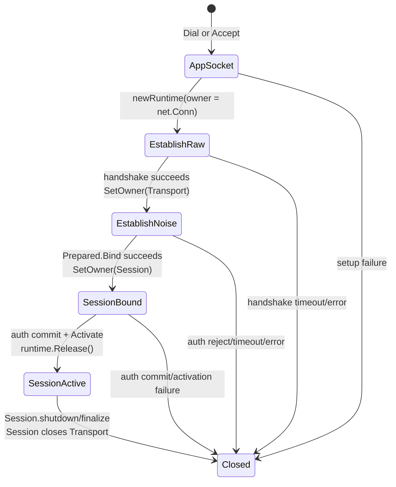
```mermaid
stateDiagram-v2
    [*] --> AppSocket: Dial or Accept
    AppSocket --> EstablishRaw: newRuntime(owner = net.Conn)
    EstablishRaw --> EstablishNoise: handshake succeeds<br/>SetOwner(Transport)
    EstablishNoise --> SessionBound: Prepared.Bind succeeds<br/>SetOwner(Session)
    SessionBound --> SessionActive: auth commit + Activate<br/>runtime.Release()
    SessionActive --> Closed: Session.shutdown/finalize<br/>Session closes Transport

    AppSocket --> Closed: setup failure
    EstablishRaw --> Closed: handshake timeout/error
    EstablishNoise --> Closed: auth reject/timeout/error
    SessionBound --> Closed: auth commit/activation failure
```

`runtime.Release()` does not detach cancellation. It clears the runtime's
direct close owner, while the session remains parented to `runtime.Context()`.
Thus a later parent cancellation reaches the session's own shutdown callback,
and the session closes the transport.

---

## 3. Top-level process lifecycle

### 3.1 CLI and root ownership

[`bin/mygosh.go`](bin/mygosh.go) creates one process context with
`signal.NotifyContext` for `SIGINT` and `SIGTERM`. Each Cobra subcommand loads
its own strict configuration file, then creates `root.Root`, which installs
the app-owned diagnostic logger as `slog.Default`.

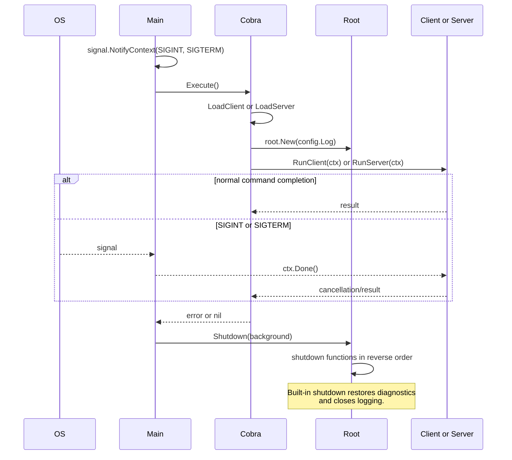
```mermaid
sequenceDiagram
    participant OS
    participant Main
    participant Cobra
    participant Root
    participant App as Client or Server

    Main->>Main: signal.NotifyContext(SIGINT, SIGTERM)
    Main->>Cobra: Execute()
    Cobra->>Cobra: LoadClient or LoadServer
    Cobra->>Root: root.New(config.Log)
    Cobra->>App: RunClient(ctx) or RunServer(ctx)

    alt normal command completion
        App-->>Cobra: result
    else SIGINT or SIGTERM
        OS-->>Main: signal
        Main-->>App: ctx.Done()
        App-->>Cobra: cancellation/result
    end

    Cobra-->>Main: error or nil
    Main->>Root: Shutdown(background)
    Root->>Root: shutdown functions in reverse order
    Note over Root: Built-in shutdown restores diagnostics<br/>and closes logging.
```

`root.Root` provides a one-shot LIFO shutdown stack. Registration and
snapshotting are mutex-protected. Shutdown functions are invoked outside the
mutex, so a shutdown function cannot deadlock merely by registering another
callback. Its built-in shutdown restores the previous process-wide diagnostic
logger and closes the app-owned logging service.

### 3.2 Server process lifetime

The server currently has a deliberately narrow lifetime:

```text
load host key
  -> build authorization policy
  -> listen
  -> accept one connection
  -> run that connection to Session.Wait()
  -> return from RunServer
  -> process shutdown
```

The listener has two close paths:

1. a `context.AfterFunc` closes it when the process context is canceled, which
   unblocks `Accept`;
2. a deferred close handles every ordinary return.

Both may run, and `net.Listener.Close` is treated as safely repeatable for
cleanup purposes. If `Accept` fails after cancellation, the function returns
the context cause instead of reporting a misleading accept error.

### 3.3 Client process lifetime

The client loads its private key and `known_hosts` before dialing. After a
successful dial, `establish.Connect` consumes connection ownership. A deferred
`established.Close()` covers every later return.

The command client is nested inside the session:

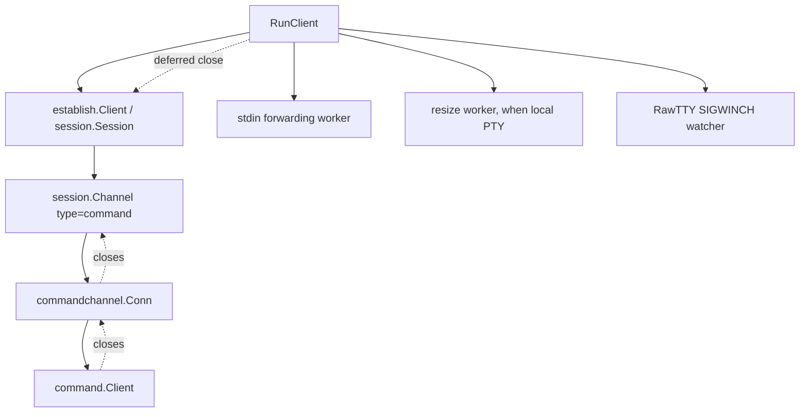
```mermaid
flowchart TD
    RUN["RunClient"]
    SESSION["establish.Client / session.Session"]
    CHANNEL["session.Channel type=command"]
    ADAPTER["commandchannel.Conn"]
    COMMAND["command.Client"]
    INPUT["stdin forwarding worker"]
    RESIZE["resize worker, when local PTY"]
    RAW["RawTTY SIGWINCH watcher"]

    RUN --> SESSION --> CHANNEL --> ADAPTER --> COMMAND
    RUN --> INPUT
    RUN --> RESIZE
    RUN --> RAW

    COMMAND -. closes .-> ADAPTER
    ADAPTER -. closes .-> CHANNEL
    RUN -. deferred close .-> SESSION
```

---

## 4. Connection establishment and authentication

### 4.1 Establishment phase machine

The phase labels are maintained by [`lib/establish/runtime.go`](lib/establish/runtime.go).

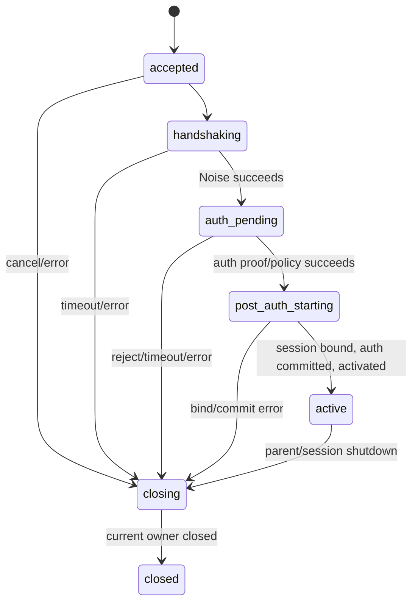
```mermaid
stateDiagram-v2
    [*] --> accepted
    accepted --> handshaking
    handshaking --> auth_pending: Noise succeeds
    auth_pending --> post_auth_starting: auth proof/policy succeeds
    post_auth_starting --> active: session bound, auth committed, activated
    accepted --> closing: cancel/error
    handshaking --> closing: timeout/error
    auth_pending --> closing: reject/timeout/error
    post_auth_starting --> closing: bind/commit error
    active --> closing: parent/session shutdown
    closing --> closed: current owner closed
```

The runtime owns:

- a cancel-cause context;
- the current `io.Closer`;
- a phase timeout timer;
- the first terminal cause;
- one goroutine that closes the current owner when the runtime context ends.

`Fail` records the first terminal cause, marks the phase closing, cancels the
context, and closes the current owner. The cleanup goroutine may race with the
direct close, but `closeCurrentOwner` atomically removes the owner before
calling it, so only one path receives the closer.

If the owner implements `SetDeadline`, establishment sets an immediate deadline
before closing. This helps unblock an in-flight read or write before the close.

### 4.2 Client establishment

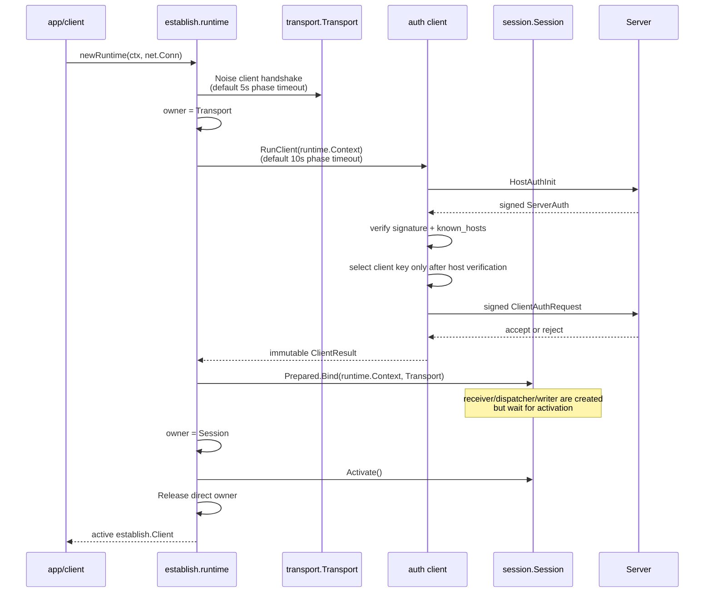
```mermaid
sequenceDiagram
    participant App as app/client
    participant RT as establish.runtime
    participant T as transport.Transport
    participant A as auth client
    participant S as session.Session
    participant Peer as Server

    App->>RT: newRuntime(ctx, net.Conn)
    RT->>T: Noise client handshake<br/>(default 5s phase timeout)
    RT->>RT: owner = Transport
    RT->>A: RunClient(runtime.Context)<br/>(default 10s phase timeout)
    A->>Peer: HostAuthInit
    Peer-->>A: signed ServerAuth
    A->>A: verify signature + known_hosts
    A->>A: select client key only after host verification
    A->>Peer: signed ClientAuthRequest
    Peer-->>A: accept or reject
    A-->>RT: immutable ClientResult
    RT->>S: Prepared.Bind(runtime.Context, Transport)
    Note over S: receiver/dispatcher/writer are created<br/>but wait for activation
    RT->>RT: owner = Session
    RT->>S: Activate()
    RT->>RT: Release direct owner
    RT-->>App: active establish.Client
```

The client auth timeout covers the complete blocking auth exchange, including
waiting for the server's final response. A timeout calls `runtime.Fail`, which
closes the transport and unblocks auth I/O.

### 4.3 Staged server establishment

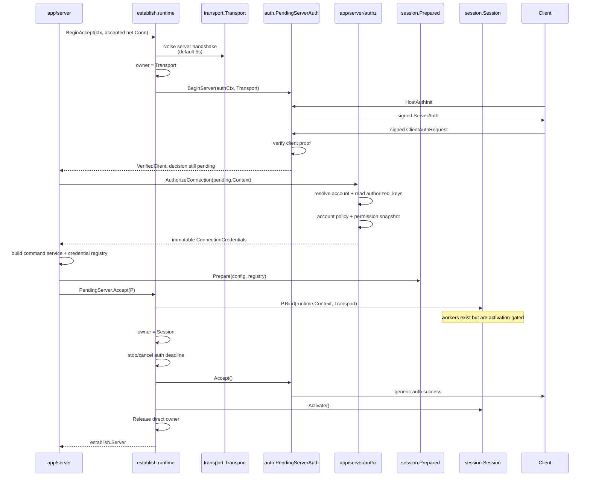
```mermaid
sequenceDiagram
    participant App as app/server
    participant RT as establish.runtime
    participant T as transport.Transport
    participant A as auth.PendingServerAuth
    participant Z as app/server/authz
    participant P as session.Prepared
    participant S as session.Session
    participant Client

    App->>RT: BeginAccept(ctx, accepted net.Conn)
    RT->>T: Noise server handshake<br/>(default 5s)
    RT->>RT: owner = Transport
    RT->>A: BeginServer(authCtx, Transport)
    Client->>A: HostAuthInit
    A->>Client: signed ServerAuth
    Client->>A: signed ClientAuthRequest
    A->>A: verify client proof
    A-->>App: VerifiedClient, decision still pending

    App->>Z: AuthorizeConnection(pending.Context)
    Z->>Z: resolve account + read authorized_keys
    Z->>Z: account policy + permission snapshot
    Z-->>App: immutable ConnectionCredentials
    App->>App: build command service + credential registry
    App->>P: Prepare(config, registry)
    App->>RT: PendingServer.Accept(P)
    RT->>S: P.Bind(runtime.Context, Transport)
    Note over S: workers exist but are activation-gated
    RT->>RT: owner = Session
    RT->>RT: stop/cancel auth deadline
    RT->>A: Accept()
    A->>Client: generic auth success
    RT->>S: Activate()
    RT->>RT: Release direct owner
    RT-->>App: establish.Server
```

The server auth deadline intentionally spans client proof verification and
application policy. `pending.Context()` is the timeout-bearing context used by
account resolution, secure file checks, and permission policy.

At commit time, `completeAuthDeadline` stops/cancels that context immediately
before writing the final auth success. Therefore the policy decision is
deadline-bound, but the final success write itself is not protected by that
auth timer. A blocked transport write still requires connection closure or an
external deadline to unblock.

### 4.4 One-shot decision semantics

Both `establish.PendingServer` and `auth.PendingServerAuth` guard their
decisions:

- only the undecided state may become accepted or rejected;
- the decision is claimed before the wire response is attempted;
- a failed response cannot be retried as the opposite decision;
- `PendingServer.Close` closes the establishment only while ownership has not
  transferred;
- after successful transfer, the server's deferred `pending.Close()` is a
  no-op and the session is the owner.

Rejection sends one generic `authentication-failed` response, stops the auth
deadline, and closes the runtime/transport.

### 4.5 Auth state machines

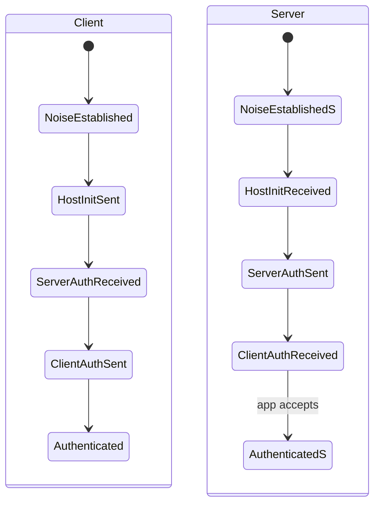
```mermaid
stateDiagram-v2
    state Client {
        [*] --> NoiseEstablished
        NoiseEstablished --> HostInitSent
        HostInitSent --> ServerAuthReceived
        ServerAuthReceived --> ClientAuthSent
        ClientAuthSent --> Authenticated
    }

    state Server {
        [*] --> NoiseEstablishedS
        NoiseEstablishedS --> HostInitReceived
        HostInitReceived --> ServerAuthSent
        ServerAuthSent --> ClientAuthReceived
        ClientAuthReceived --> AuthenticatedS: app accepts
    }
```

The signatures bind the Noise channel binding and deterministic hashes of the
auth transcript. The client verifies the server host key before obtaining and
using its client signer.

---

## 5. Session lifecycle and concurrency

### 5.1 Prepare, bind, activate

The session has three distinct construction stages:

| Stage | Work performed | I/O allowed? |
|---|---|---:|
| `Prepare` | validate config and hard limits; capture handler | No |
| `Bind` | create context, maps, queues, and three workers | Workers wait |
| `Activate` | close the one-shot `activated` channel | Yes |

This split is what allows the server to construct the post-auth runtime before
sending auth success without creating a competing auth/session reader.

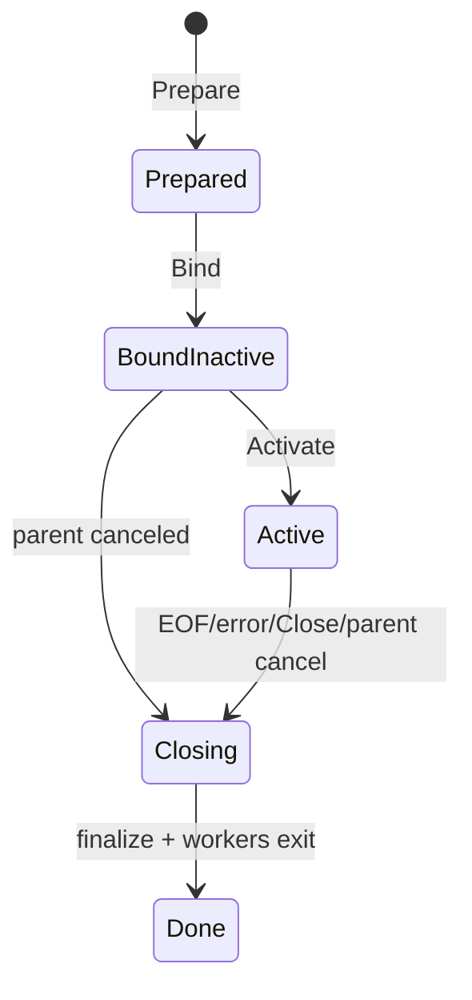
```mermaid
stateDiagram-v2
    [*] --> Prepared: Prepare
    Prepared --> BoundInactive: Bind
    BoundInactive --> Active: Activate
    BoundInactive --> Closing: parent canceled
    Active --> Closing: EOF/error/Close/parent cancel
    Closing --> Done: finalize + workers exit
```

### 5.2 Goroutine and queue architecture

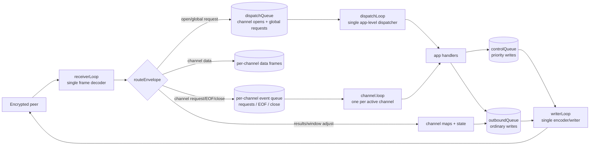
```mermaid
flowchart LR
    PEER["Encrypted peer"]
    RX["receiverLoop<br/>single frame decoder"]
    ROUTE{"routeEnvelope"}
    DISPATCHQ[("dispatchQueue<br/>channel opens + global requests")]
    DISPATCH["dispatchLoop<br/>single app-level dispatcher"]
    CHANNELS["channel maps + state"]
    DATAQ[("per-channel data frames")]
    EVENTQ[("per-channel event queue<br/>requests / EOF / close")]
    CHWORK["channel.loop<br/>one per active channel"]
    HANDLERS["app handlers"]
    CTRLQ[("controlQueue<br/>priority writes")]
    OUTQ[("outboundQueue<br/>ordinary writes")]
    WRITER["writerLoop<br/>single encoder/writer"]

    PEER --> RX --> ROUTE
    ROUTE -->|open/global request| DISPATCHQ --> DISPATCH --> HANDLERS
    ROUTE -->|channel data| DATAQ
    ROUTE -->|channel request/EOF/close| EVENTQ --> CHWORK --> HANDLERS
    ROUTE -->|results/window adjust| CHANNELS

    HANDLERS --> CTRLQ
    HANDLERS --> OUTQ
    CHANNELS --> OUTQ
    CTRLQ --> WRITER
    OUTQ --> WRITER
    WRITER --> PEER
```

The receive loop only decodes, validates, updates bounded state, and enqueues
work. It does not call application policy or service handlers.

The dispatch loop serializes:

- incoming channel-open policy;
- global-request handlers.

Each active channel worker serializes that channel's:

- `OnOpen`;
- channel requests;
- EOF callback;
- close callback.

Channel data is intentionally not delivered through the event worker. It is
queued in `Channel.frames` and consumed by callers of `Channel.Recv`.

### 5.3 Worker creation

At `Session.Bind`, three goroutines are added to the session wait group:

1. `receiverLoop`;
2. `dispatchLoop`;
3. `writerLoop`.

Each accepted or successfully opened channel adds one `channel.loop` worker to
the same wait group. A channel worker starts:

- on the receiving side only after the channel-open acceptance frame has
  actually been written;
- on the opening side after the acceptance result has been validated and
  channel state has become open.

That ordering prevents `OnOpen` from acting on a channel the peer has not yet
been told is usable.

### 5.4 Queue and memory bounds

The session uses one shared frame/byte budget across:

- dispatch tasks;
- both writer queues;
- per-channel event queues;
- per-channel received-data queues.

Each channel additionally has its own frame and byte budget.

| Structure | Capacity/control | Producer | Consumer |
|---|---|---|---|
| `dispatchQueue` | `MaxQueuedFramesTotal`, plus shared budget | receiver | dispatch worker |
| `controlQueue` | same channel capacity, plus shared budget | close/reject/disconnect paths | writer |
| `outboundQueue` | same channel capacity, plus shared budget | normal send callers | writer |
| `Channel.events` | `MaxQueuedFramesPerChannel`, plus local/global budgets | receiver | channel worker |
| `Channel.frames` | local/global frame and byte budgets | receiver | `Channel.Recv` caller |
| pending global map | `MaxPendingGlobalRequests` | request sender | receiver result path |
| pending channel map | per-channel and connection limits | request sender | receiver result path |
| channel maps | active + pending limits | open paths | close/removal paths |

Control writes receive preference on each writer iteration. A continuously
non-empty control queue can delay ordinary output, but close/reject traffic is
less likely to be trapped behind bulk traffic.

If the outbound channel itself is unexpectedly full after budget reservation,
the send reports exhaustion and launches session shutdown. This defensive
goroutine avoids trying to call `shutdown` while holding queue-related locks.

### 5.5 Serialized writes and cancellation

Every synchronous send creates an `outboundWrite` with this state machine:

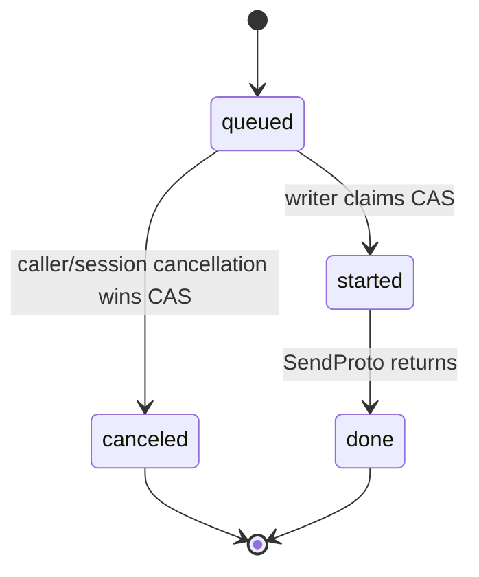
```mermaid
stateDiagram-v2
    [*] --> queued
    queued --> started: writer claims CAS
    queued --> canceled: caller/session cancellation wins CAS
    started --> done: SendProto returns
    canceled --> [*]
    done --> [*]
```

If cancellation changes `queued` to `canceled`, the caller returns and the
writer later skips the frame. If the writer already changed it to `started`,
the frame cannot safely be abandoned because Noise cipher state may already
advance.

> **Current caveat:** `sendEnvelopeAfter` keeps selecting after a failed
> cancellation CAS. Since the canceled context remains ready, it can spin while
> waiting for the writer result. A blocked started write therefore outlives the
> caller's timeout until the underlying connection is closed or the write
> completes.

Any actual writer error is connection-fatal. The writer reports the result,
calls session shutdown, and exits.

### 5.6 Channel state machine

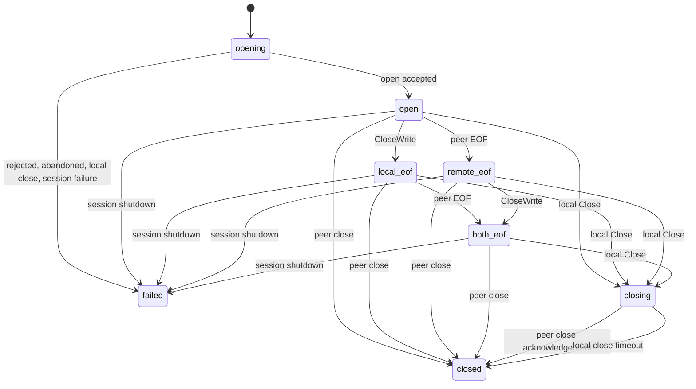
```mermaid
stateDiagram-v2
    [*] --> opening
    opening --> open: open accepted
    opening --> failed: rejected, abandoned, local close, session failure

    open --> local_eof: CloseWrite
    open --> remote_eof: peer EOF
    local_eof --> both_eof: peer EOF
    remote_eof --> both_eof: CloseWrite

    open --> closing: local Close
    local_eof --> closing: local Close
    remote_eof --> closing: local Close
    both_eof --> closing: local Close

    open --> closed: peer close
    local_eof --> closed: peer close
    remote_eof --> closed: peer close
    both_eof --> closed: peer close

    closing --> closed: peer close acknowledgement
    closing --> closed: local close timeout

    open --> failed: session shutdown
    local_eof --> failed: session shutdown
    remote_eof --> failed: session shutdown
    both_eof --> failed: session shutdown
```

Directionality is explicit:

| State | May send data? | May receive data? | Requests allowed? |
|---|---:|---:|---:|
| open | Yes | Yes | Yes |
| local EOF | No | Yes | Yes |
| remote EOF | Yes | No | Yes |
| both EOF | No | No | Yes |
| closing/closed/failed | No | No | No |

`Channel.Recv` preserves frames already queued before a remote close. It
returns EOF only after those frames drain. `CloseWrite` is a protocol half
close and sends channel EOF; it does not close the underlying transport.

`Channel.Close`:

1. changes the state to closing;
2. discards queued inbound data;
3. fails pending request waiters;
4. cancels the channel context;
5. enqueues a priority close frame;
6. starts a close-timeout goroutine.

The timeout removes the channel locally if no peer acknowledgement arrives.

### 5.7 Channel communication paths

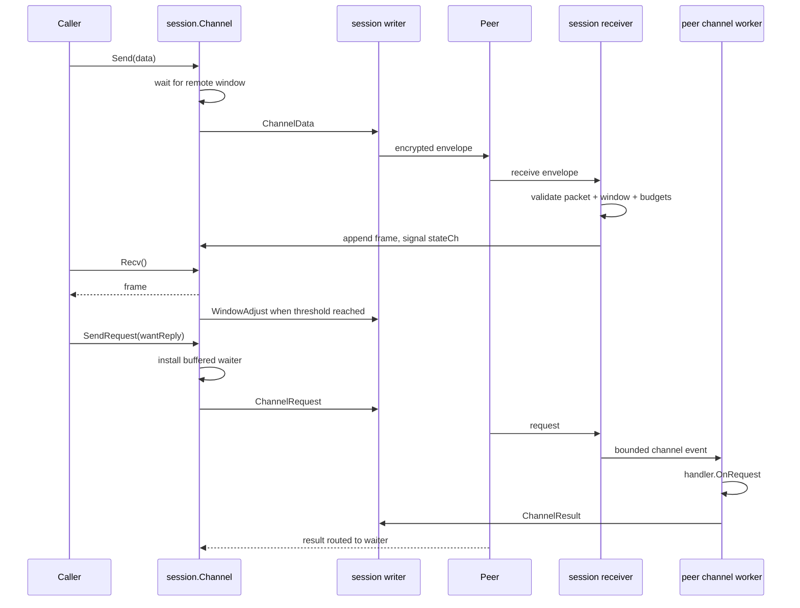
```mermaid
sequenceDiagram
    participant Caller
    participant Ch as session.Channel
    participant W as session writer
    participant Peer
    participant R as session receiver
    participant CW as peer channel worker

    Caller->>Ch: Send(data)
    Ch->>Ch: wait for remote window
    Ch->>W: ChannelData
    W->>Peer: encrypted envelope
    Peer->>R: receive envelope
    R->>R: validate packet + window + budgets
    R->>Ch: append frame, signal stateCh
    Caller->>Ch: Recv()
    Ch-->>Caller: frame
    Ch->>W: WindowAdjust when threshold reached

    Caller->>Ch: SendRequest(wantReply)
    Ch->>Ch: install buffered waiter
    Ch->>W: ChannelRequest
    Peer->>R: request
    R->>CW: bounded channel event
    CW->>CW: handler.OnRequest
    CW->>W: ChannelResult
    Peer-->>Ch: result routed to waiter
```

`stateCh` is a replaceable broadcast channel. Any state/window/data change
closes the old channel and allocates a new one, waking all current waiters
without retaining a notification token.

### 5.8 Session shutdown sequence

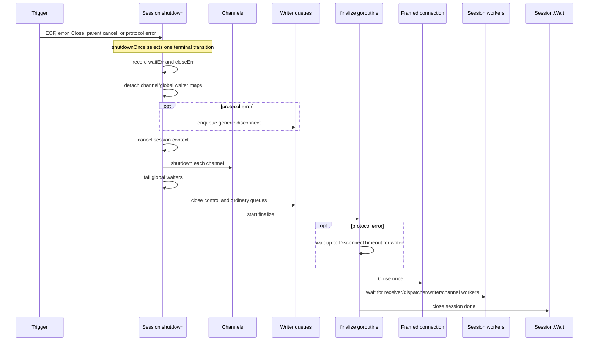
```mermaid
sequenceDiagram
    participant Trigger
    participant S as Session.shutdown
    participant Ch as Channels
    participant Q as Writer queues
    participant F as finalize goroutine
    participant Conn as Framed connection
    participant WG as Session workers
    participant Waiter as Session.Wait

    Trigger->>S: EOF, error, Close, parent cancel, or protocol error
    Note over S: shutdownOnce selects one terminal transition
    S->>S: record waitErr and closeErr
    S->>S: detach channel/global waiter maps
    opt protocol error
        S->>Q: enqueue generic disconnect
    end
    S->>S: cancel session context
    S->>Ch: shutdown each channel
    S->>S: fail global waiters
    S->>Q: close control and ordinary queues
    S->>F: start finalize
    opt protocol error
        F->>F: wait up to DisconnectTimeout for writer
    end
    F->>Conn: Close once
    F->>WG: Wait for receiver/dispatcher/writer/channel workers
    F->>Waiter: close session done
```

Terminal result semantics:

- clean remote EOF calls `shutdown(nil)`, so `Session.Wait()` returns `nil`;
- local `Session.Close()` calls `shutdown(context.Canceled)`, so `Wait` returns
  cancellation;
- protocol, read, write, queue, or parent errors become the wait result;
- channel and request waiters receive the session's close error even when the
  top-level wait result is a clean `nil`.

The framed connection is closed before waiting for workers, which unblocks the
receiver and any in-progress transport I/O. `done` closes only after every
session-tracked worker exits.

---

## 6. Authorization ownership

### 6.1 Connection credential snapshot

`app/server/authz` turns a cryptographic proof into one immutable
connection-scoped value:

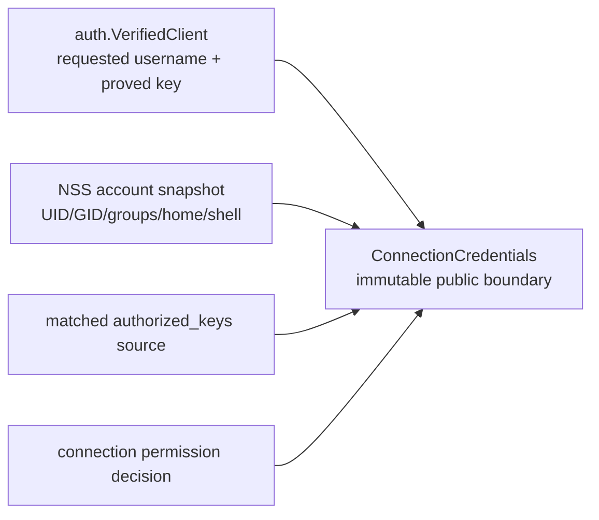
```mermaid
flowchart LR
    VERIFIED["auth.VerifiedClient<br/>requested username + proved key"]
    ACCOUNT["NSS account snapshot<br/>UID/GID/groups/home/shell"]
    KEYS["matched authorized_keys source"]
    POLICY["connection permission decision"]
    CREDS["ConnectionCredentials<br/>immutable public boundary"]

    VERIFIED --> CREDS
    ACCOUNT --> CREDS
    KEYS --> CREDS
    POLICY --> CREDS
```

Key, account, group, and environment slices are cloned at the credential
boundary and cloned again by accessors. The service registry stores one
credential value for the connection lifetime.

### 6.2 Request-specific capabilities

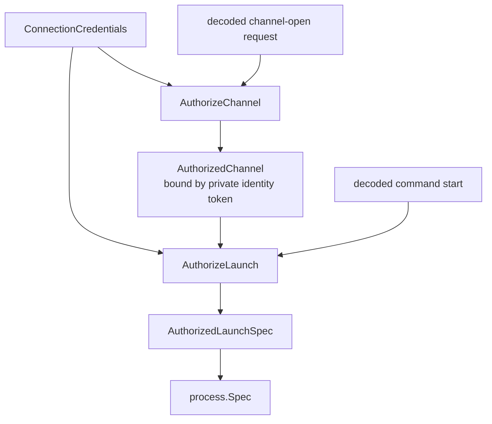
```mermaid
flowchart TD
    CREDS["ConnectionCredentials"]
    OPEN["decoded channel-open request"]
    CHAUTH["AuthorizeChannel"]
    GRANT["AuthorizedChannel<br/>bound by private identity token"]
    START["decoded command start"]
    LAUNCH["AuthorizeLaunch"]
    SPEC["AuthorizedLaunchSpec"]
    PROC["process.Spec"]

    CREDS --> CHAUTH
    OPEN --> CHAUTH
    CHAUTH --> GRANT
    CREDS --> LAUNCH
    GRANT --> LAUNCH
    START --> LAUNCH
    LAUNCH --> SPEC --> PROC
```

The private pointer token in `AuthorizedChannel` prevents accidentally mixing
a channel grant with a different credential snapshot in the same process. It
is an in-process capability, not a transferable worker credential.

No PTY or child process is allocated until exact launch authorization has
validated:

- shell versus exec permission;
- forced command;
- PTY permission and dimensions;
- environment allowlist;
- account home and shell paths;
- command size and NUL constraints.

---

## 7. Command protocol ownership and concurrency

### 7.1 Adapter boundary

`commandchannel.Conn` delegates:

| Command operation | Session operation |
|---|---|
| `Context()` | `Channel.Context()` |
| `SendFrame` | `Channel.Send` |
| `ReceiveFrame` | `Channel.Recv` |
| `MaxSendFrameSize` | peer-advertised channel packet size |
| `Close` | `Channel.Close` |

The command protocol therefore owns command ordering and chunking, while the
session owns channel flow control, multiplexing, queue bounds, and close.

### 7.2 Command client state

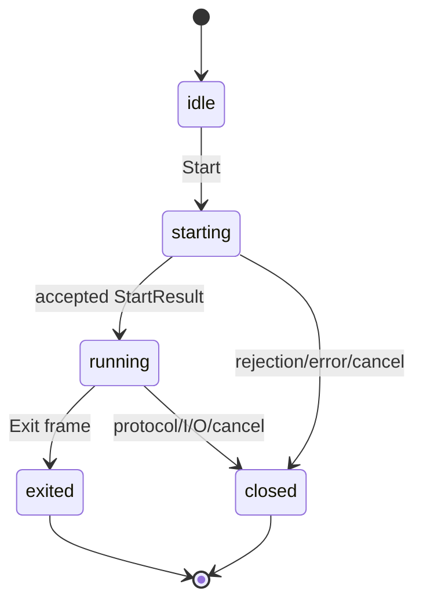
```mermaid
stateDiagram-v2
    [*] --> idle
    idle --> starting: Start
    starting --> running: accepted StartResult
    starting --> closed: rejection/error/cancel
    running --> exited: Exit frame
    running --> closed: protocol/I/O/cancel
    exited --> [*]
    closed --> [*]
```

`Start` launches exactly one receive goroutine before sending the start frame.
That goroutine is the sole command-frame reader. It writes stdout/stderr to the
configured sinks and calls `finish` on exit or error.

All client command writes share `writeMu`, because stdin forwarding and resize
forwarding may run concurrently. `finish` is guarded by `sync.Once`; it stores
the result, wakes a blocked `Start`, closes the channel adapter, and closes the
client's `done` channel.

### 7.3 Server command service

The session channel worker invokes `channelHandler.OnOpen`. `OnOpen` creates
the adapter and starts a separate goroutine for `command.Serve`, then returns.

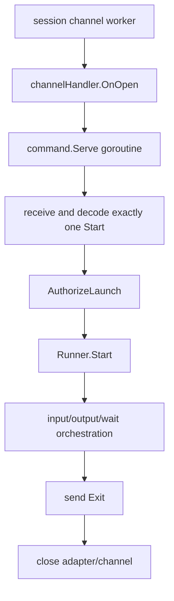
```mermaid
flowchart TD
    CHWORK["session channel worker"]
    ONOPEN["channelHandler.OnOpen"]
    SERVEG["command.Serve goroutine"]
    START["receive and decode exactly one Start"]
    AUTH["AuthorizeLaunch"]
    PROC["Runner.Start"]
    IO["input/output/wait orchestration"]
    EXIT["send Exit"]
    CLOSE["close adapter/channel"]

    CHWORK --> ONOPEN --> SERVEG
    SERVEG --> START --> AUTH --> PROC --> IO --> EXIT --> CLOSE
```

This separation keeps a long-running command from blocking channel request
dispatch, though command channels currently reject session-level channel
requests anyway.

### 7.4 Per-command server goroutines

After process start and start acceptance, `command.Serve` creates:

- one stdout copy goroutine;
- one stderr copy goroutine for non-PTY processes;
- one command-input receive goroutine;
- one goroutine waiting on `RunningProcess.Wait`.

```mermaid
flowchart LR
    ORCH["command.Serve orchestration loop"]
    STDOUT["stdout copier"]
    STDERR["stderr copier<br/>non-PTY only"]
    INPUT["command input receiver"]
    WAIT["process.Wait waiter"]
    WRITEMU["server command writeMu"]
    CONN["command FrameConn"]
    PROC["RunningProcess"]

    PROC --> STDOUT --> WRITEMU --> CONN
    PROC --> STDERR --> WRITEMU
    CONN --> INPUT --> PROC
    PROC --> WAIT --> ORCH
    STDOUT --> ORCH
    STDERR --> ORCH
    INPUT --> ORCH
```

The orchestration loop is the command protocol's terminal decision owner:

- input failure, output failure, or channel cancellation records the first
  protocol/runtime failure and calls `process.Terminate`;
- process exit ends the main loop;
- remaining output is drained for up to five seconds;
- a drain timeout cancels output, closes output descriptors, and reports a
  generic runtime failure;
- the exit frame uses a nominal two-second context.

Because command writes ultimately use session synchronous writes, the session's
started-write cancellation caveat also applies to start, output, and exit
frames. The nominal terminal-send timeout cannot interrupt a session write
already claimed by its writer.

### 7.5 Command data chunking

The command layer binary-searches for the largest data chunk whose encoded
protobuf fits the channel's advertised maximum frame size. This preserves raw
terminal bytes while accounting for protobuf overhead.

Non-PTY output remains directional:

- stdout → `ServerFrame.Stdout`;
- stderr → `ServerFrame.Stderr`.

PTY output is one merged stream, and a PTY command receiving stderr is a
protocol error on the client.

---

## 8. Unix process ownership

### 8.1 Start and descriptor topology

The process runner receives a cloned, already-authorized plain `Spec`. It does
not resolve users, inspect trust files, or make launch-policy decisions.

#### Non-PTY process

```mermaid
flowchart LR
    SERVER["server process"]
    INW["parent stdin write"]
    INR["child stdin read"]
    OUTW["child stdout write"]
    OUTR["parent stdout read"]
    ERRW["child stderr write"]
    ERRR["parent stderr read"]
    CHILD["child process group"]

    SERVER --> INW --> INR --> CHILD
    CHILD --> OUTW --> OUTR --> SERVER
    CHILD --> ERRW --> ERRR --> SERVER
```

The parent closes its copies of the child-side pipe ends immediately after a
successful `cmd.Start`.

#### PTY process

```mermaid
flowchart LR
    SERVER["server process"]
    MASTER["PTY master<br/>single bidirectional descriptor"]
    SLAVE["PTY slave<br/>controlling terminal"]
    CHILD["new session / process group"]

    SERVER <--> MASTER <--> SLAVE <--> CHILD
```

The PTY master is exposed as stdin and wrapped as stdout. PTY `EIO` is
normalized to EOF. `CloseStdin` deliberately does not close the PTY master,
because doing so would also destroy output and commonly send `SIGHUP`.

### 8.2 Identity and process-group setup

For a root server, `syscall.Credential` carries the requested UID, GID, and
supplementary groups. For an unprivileged server, the runner verifies that its
effective UID/GID/groups already match the specification and sets
`NoSetGroups`.

Non-PTY commands use `Setpgid`; PTY commands use `Setsid` and `Setctty`. Both
forms make negative-PID group signaling available for descendant cleanup.

### 8.3 Runner goroutines

`Runner.Start` creates two long-lived goroutines:

1. `running.wait`, the sole caller of `cmd.Wait`;
2. a context watcher that calls `Terminate` when the command/channel context
   ends, or exits when process cleanup completes.

`Terminate` is guarded by `terminateOnce` and may launch one additional
termination goroutine. The command protocol's own wait goroutine calls
`RunningProcess.Wait`; it never calls `cmd.Wait`.

### 8.4 Termination and reaping

```mermaid
sequenceDiagram
    participant Cause as Context/protocol/process exit
    participant RP as runningProcess
    participant Group as Process group
    participant Wait as cmd.Wait owner
    participant Consumer as RunningProcess.Wait callers

    Cause->>RP: Terminate(cause) or natural wait completion
    RP->>RP: terminateOnce / terminating flag
    RP->>RP: CloseStdin
    RP->>Group: SIGTERM to -PID

    alt group exits during grace
        RP->>Wait: await processWaitDone
    else grace expires
        RP->>Group: SIGKILL to -PID
        RP->>Wait: await processWaitDone
    end

    Wait->>Wait: cmd.Wait exactly once
    Wait->>RP: store ExitResult + close processWaitDone
    RP->>RP: complete + close done once
    RP-->>Consumer: immutable ExitResult
```

Natural leader exit also enters descendant cleanup. `running.wait` records the
leader's exit result, closes `processWaitDone`, and then runs termination logic
to remove any process-group descendants that outlived the leader.

The default graceful interval is two seconds. Group existence is polled every
25 ms; expiry escalates to `SIGKILL`. Process completion does not wait for peer
channel-close acknowledgement.

### 8.5 Nested-lifetime caveat

The server command goroutine is launched by `channelHandler.OnOpen`, but is not
added to `session.Session.wg`. On abrupt session shutdown:

1. session shutdown cancels the channel context;
2. the channel worker exits and is joined by session finalization;
3. `Session.Wait` may return;
4. the separately spawned `command.Serve` goroutine observes cancellation,
   terminates the process, drains output, and exits on its own timeline.

The process owner itself has bounded TERM/KILL cleanup, but the top-level
server does not explicitly join that detached command/process tree before
`RunServer` returns. In the current one-connection executable, process exit can
therefore race with the remaining cleanup goroutines during abrupt shutdown.
This is one reason the open worker-supervision work requires a terminal
connection owner that joins service and child cleanup.

---

## 9. Client terminal and local descriptor lifecycle

### 9.1 Raw terminal

If a PTY is requested and stdin is a local terminal:

1. `term.MakeRaw` returns the old terminal state;
2. `RawTTY` starts a `SIGWINCH` watcher;
3. resize notifications enter a size-one channel with drop-on-full behavior;
4. command cancellation stops the watcher and closes the resize channel;
5. deferred `Restore` restores the terminal exactly once.

Dropping duplicate resize events is safe because each event carries the newest
queried terminal dimensions.

### 9.2 Cancellable input

`PollReader` duplicates stdin rather than taking ownership of the caller's
original descriptor. It also owns a private pipe used solely to wake `poll`.

```mermaid
flowchart LR
    STDIN["original os.Stdin<br/>never closed by PollReader"]
    DUP["duplicated input fd"]
    POLL["unix.Poll"]
    CANCELR["cancel pipe read"]
    CANCELW["cancel pipe write"]
    CTX["read context / Close"]

    STDIN -->|dup| DUP --> POLL
    CANCELR --> POLL
    CTX --> CANCELW --> CANCELR
```

Each read installs a context callback that writes one byte to the wake pipe.
`Close` marks the reader closed, wakes any poll, and closes the duplicate plus
both pipe ends once.

### 9.3 Client command cancellation

```mermaid
sequenceDiagram
    participant Signal as Parent ctx / input / resize error
    participant CCtx as commandCtx
    participant Cmd as command.Client
    participant Ch as session.Channel
    participant Input as input worker
    participant Resize as resize worker
    participant Run as RunClient

    Signal->>CCtx: cancel cause
    CCtx->>Cmd: AfterFunc calls Close
    Cmd->>Ch: Close
    Ch-->>Cmd: receive loop wakes/ends
    Cmd->>Cmd: finish once, close done
    Run->>Run: commandClient.Wait returns
    Run->>CCtx: cancel with wait result
    Run->>Input: close PollReader
    Run->>Input: WaitGroup join
    Run->>Resize: WaitGroup join
    Run->>Run: restore terminal
    Run->>Run: deferred session Close
```

The application does join its input and resize workers before returning.
Remote exit status or signal is translated to a local process exit code after
those workers have stopped.

---

## 10. Secure-file descriptor ownership

`app/securefiles.Read` owns path policy; `lib/strictfiles` owns descriptor-safe
opening and metadata checks.

```mermaid
sequenceDiagram
    participant App
    participant SF as app/securefiles
    participant CF as strictfiles.CheckedFile
    participant OSF as os.File

    App->>SF: Read(anchor, relative, policy)
    SF->>CF: OpenDirWithOptions(anchor)
    loop every intermediate component
        SF->>CF: OpenAt(directory, no symlinks)
        SF->>CF: close previous pinned directory
    end
    SF->>CF: OpenAt(final regular file)
    CF->>OSF: ToFile transfers fd ownership
    SF->>OSF: bounded ReadAll
    SF->>OSF: deferred Close
    SF->>CF: deferred close of final directory anchor
    SF-->>App: owned byte slice, no live fd
```

`CheckedFile` values must not be copied after use. A live value owns its
descriptor until either:

- `Close` atomically marks it closed and closes the fd; or
- `ToFile` atomically marks it transferred and returns the sole `*os.File`
  owner.

All opens use close-on-exec. The lower path is pinned and traversed without
following symlinks. Private-key and trust-file bytes outlive the file
descriptors, but only as bounded in-memory values.

---

## 11. Shutdown and failure scenarios

| Scenario | First trigger | Downward propagation | Final network owner | Top-level result |
|---|---|---|---|---|
| Normal remote command exit | child exits | process result → command exit → command client closes channel | session, later client defer | remote status/signal translated locally |
| Client `SIGINT`/`SIGTERM` | main context canceled | command close, channel close, session parent cancellation | client session | usually cancellation/exit 1 |
| Server `SIGINT`/`SIGTERM` before accept | listener callback closes listener | `Accept` unblocks | app listener/none | context cause |
| Server signal during handshake/auth | runtime parent canceled | runtime cleanup closes current raw/Noise owner | establish runtime | context cause |
| Server signal during active session | runtime context canceled | session parent callback → channel cancellation → process termination | session | context cause |
| Auth policy rejection | app calls `pending.Reject` | generic reject → timeout stop → runtime close | establish runtime | authorization error joined with cleanup |
| Auth timeout | auth context callback | `runtime.Fail(deadline)` closes transport | establish runtime | deadline exceeded |
| Clean peer TCP close | session receiver sees EOF | `shutdown(nil)` → channels canceled → connection close/join | session | `Session.Wait == nil` |
| Malformed session frame | receiver/dispatcher returns protocol error | best-effort generic disconnect, cancel, bounded writer wait | session | protocol error |
| Session writer failure | writer reports send error | immediate session shutdown | session | wrapped send error |
| Local channel close | caller invokes `Channel.Close` | priority close frame + canceled channel context | session still owns connection | channel removed on ack/timeout |
| Command protocol error | command orchestrator records failure | terminate process → generic runtime exit attempt → close channel | session | command/server debug result; client runtime error if delivered |
| Child ignores TERM | termination grace expires | `SIGKILL` process group → wait for leader reap | process owner | exit/runtime result |

### 11.1 Server signal fan-out

Callbacks from the same parent cancellation can run concurrently; ordering is
not guaranteed.

```mermaid
flowchart TD
    SIG["SIGINT / SIGTERM"]
    ROOTCTX["main context canceled"]
    LISTENER["listener AfterFunc<br/>Close listener"]
    RUNTIME["establish runtime context canceled"]
    RTCLEAN["runtime cleanup goroutine<br/>close current owner if any"]
    SESSCB["session parent AfterFunc<br/>shutdown session"]
    SESSION["session context canceled"]
    CHANNEL["channel contexts canceled"]
    COMMAND["command Serve notices channel close"]
    PROCESS["process Terminate"]
    TERM["SIGTERM → grace → SIGKILL"]

    SIG --> ROOTCTX
    ROOTCTX --> LISTENER
    ROOTCTX --> RUNTIME
    RUNTIME --> RTCLEAN
    RUNTIME --> SESSCB --> SESSION --> CHANNEL --> COMMAND --> PROCESS --> TERM
```

During an active session, the runtime has released its direct owner, so its
cleanup goroutine closes nothing. The session callback is the path that closes
the transport.

---

## 12. Production goroutine inventory

This table lists goroutines explicitly created by repository code, not runtime
internals used by `os/signal`, networking, timers, or the Go scheduler.

| Creator | Goroutine | Lifetime/exit condition | Explicitly joined? |
|---|---|---|---:|
| `establish.newRuntime` | wait for runtime context, close owner | runtime context done | No; closure is idempotently coordinated |
| `session.Prepared.Bind` | receiver loop | activation then EOF/error/context | Yes, session `wg` |
| `session.Prepared.Bind` | dispatch loop | activation then queue/context/error | Yes, session `wg` |
| `session.Prepared.Bind` | writer loop | activation then queues close/error | Yes, session `wg` |
| `session.startChannelWorker` | one channel event loop | channel context done or handler error | Yes, session `wg` |
| `session.enqueueWrite` on impossible/full queue | call session shutdown | one call | No |
| `session.shutdown` | finalizer | close conn, wait session workers, close done | Observed by `Session.Wait` |
| `Channel.Close` | channel close-timeout waiter | ack, timeout, or session end | No |
| `server command OnOpen` | `command.Serve` | command completes or channel ends | No session-level join |
| `command.Client.Start` | client receive loop | exit/error/close | Observed through command `done` |
| `command.server` | stdout copier | EOF/error/cancel | Joined by command orchestration counters |
| `command.server` | stderr copier, non-PTY | EOF/error/cancel | Joined by command orchestration counters |
| `command.server` | command input receiver | input error/cancel | Selected by orchestration until process exit |
| `command.server` | wait on `RunningProcess.Wait` | process owner closes done | Selected by orchestration |
| `process.Runner.Start` | sole `cmd.Wait` owner | child leader exits | Indirectly required before process done |
| `process.Runner.Start` | process-context watcher | context done or process done | No |
| `runningProcess.Terminate` | group termination worker | group gone and leader reaped | Observed through process done |
| `tty.HookRaw` | SIGWINCH watcher | command context done | Resize worker observes closed channel |
| `app/client.RunClient` | stdin forwarding | EOF/error/command cancel | Yes, app `WaitGroup` |
| `app/client.RunClient` | resize forwarding, optional | resize channel closes or command cancel | Yes, app `WaitGroup` |

### 12.1 Timer and callback inventory

These are asynchronous callbacks or timer waits rather than ordinary
long-lived worker goroutines:

| Site | Purpose | Stop path |
|---|---|---|
| `signal.NotifyContext` | cancel process context | deferred `stop` |
| server listener `context.AfterFunc` | unblock `Accept` | deferred stop function |
| establishment `time.AfterFunc` | fail handshake/auth phase | `stopTimer` |
| server auth `context.AfterFunc` | fail runtime when auth context ends | `completeAuthDeadline` |
| session parent `context.AfterFunc` | translate parent cancellation to shutdown | session finalizer |
| command context `context.AfterFunc` | close command client | deferred stop function |
| `PollReader.Read` `context.AfterFunc` | wake blocking `poll` | after each read |
| channel close timer | bound close handshake | ack/session cancellation/timer |
| command output drain timer | bound output draining | all outputs finish/timer |
| command terminal-send context | nominally bound exit send | deferred cancel |
| process grace timer/ticker | TERM-to-KILL escalation | group exit or expiry |

---

## 13. Synchronization and communication structures

| Structure | Role | Important semantic |
|---|---|---|
| cancel-cause contexts | downward lifetime propagation | preserve first meaningful cancellation cause |
| `sync.Once` | one-shot close/finish/shutdown | used by session, command client, process completion, logging, TTY restore |
| session `wg` | joins core and channel workers | does not include detached command service goroutines |
| app client `WaitGroup` | joins stdin and resize workers | terminal restoration occurs after join |
| buffered result channels, size 1 | waiter handoff without blocking receiver | global/channel/open/write/process results |
| session `activated` channel | one-shot start gate | workers exist before protocol ownership transfers |
| session `done` channel | completion publication | closes only after tracked workers exit |
| channel `stateCh` | broadcast state/window/data changes | close-and-replace wakes all current waiters |
| session writer queues | serialize all post-auth writes | control queue receives preference |
| session dispatch queue | decouple receive from app policy | one dispatcher can serialize slow global/open handlers |
| channel event queue | isolate per-channel callback ordering | bounded by local and global budgets |
| channel frame slice | channel data delivery | drained directly by `Recv`, preserves bytes |
| transport tx/rx mutexes | protect Noise cipher states | exactly one cipher-state mutation at a time |
| command write mutexes | serialize concurrent command producers | stdout/stderr/input/resize cannot interleave frames |
| process `processWaitDone` | publish leader reap | termination never completes before `cmd.Wait` |
| process `done` | publish full group cleanup/result | all `RunningProcess.Wait` callers share result |
| PollReader wake pipe | interrupt descriptor polling | does not close original stdin |

### 13.1 Synchronization domains and call path

```mermaid
flowchart TD
    SMU["Session.mu<br/>channels, request maps, terminal errors"]
    BUDGET["Session.budgetMu<br/>shared frame/byte budget"]
    QMU["Session.queueMu<br/>queue closure/enqueue race"]
    CMU["Channel.mu<br/>state, windows, frames, request maps"]
    TMU["Transport tx/rx mutexes<br/>Noise state"]
    CMDMU["Command writeMu<br/>protocol frame serialization"]
    PMU["Process waitMu/stdinMu<br/>result + descriptor state"]

    CMU -->|while held, may reserve/release| BUDGET
    QMU -->|short critical section| BUDGET
    CMDMU -->|delegates send| CMU
    CMU -->|after unlocking for network send| SMU
    SMU -->|writer eventually calls| TMU
```

The arrows show call/data flow, not simultaneous lock nesting.
The channel send path releases `Channel.mu` before waiting on the session
writer, avoiding a lock being held across network I/O. Queue closure is
separately locked so enqueue cannot race with channel close and panic by
sending to a closed queue.

---

## 14. End-to-end happy path

```mermaid
sequenceDiagram
    autonumber
    participant CLI as Client app
    participant CS as Client session
    participant NET as Noise transport
    participant SS as Server session
    participant REG as Service registry
    participant CMD as Command service
    participant PROC as Process owner

    CLI->>NET: TCP dial + Noise + auth
    Note over NET: server proof verified before client signs
    NET-->>CLI: auth accepted
    CLI->>CS: open "command" channel
    CS->>SS: ChannelOpen
    SS->>REG: authorize channel using connection credentials
    REG->>CMD: create channel handler
    SS-->>CS: ChannelOpenAccept
    CS->>SS: command Start frame
    SS->>CMD: decode exact shell/exec request
    CMD->>CMD: authorize launch
    CMD->>PROC: start authorized process specification
    CMD-->>CLI: StartResult accepted

    par stdin
        CLI->>PROC: stdin frames
    and output
        PROC-->>CLI: stdout/stderr frames
    and resize
        CLI->>PROC: PTY window changes
    end

    PROC-->>CMD: exit result after reap/descendant cleanup
    CMD-->>CLI: Exit status/signal
    CLI->>CS: close command channel
    CLI->>CS: close session on return
```

---

## 15. Current invariants

The code currently enforces these useful lifecycle invariants:

1. **One current pre-auth close owner.** Establishment swaps raw connection →
   transport → session under a mutex.
2. **One auth decision attempt.** Accept/reject cannot both run.
3. **No post-auth read before auth commit.** Bound workers wait for activation.
4. **One post-auth frame decoder.** Only `receiverLoop` calls
   `wire.ReceiveProto` after activation.
5. **One post-auth writer.** Every session envelope is serialized by
   `writerLoop`.
6. **No app handler in the receive loop.** Opens/global requests use dispatch;
   channel events use per-channel workers.
7. **Unique active peer channel IDs.** Duplicate IDs are connection-fatal
   protocol errors.
8. **Bounded peer-controlled state.** Channels, requests, queues, frames,
   bytes, and control strings all have limits.
9. **Cancellation removes local waiters.** Canceled request/open calls do not
   intentionally leave permanent pending entries.
10. **Command start is exactly once.** Both command state machines reject
    duplicate or out-of-order start.
11. **One command client reader.** Output and exit ordering are interpreted in
    a single receive loop.
12. **Serialized command writes.** Concurrent stdin, resize, stdout, and stderr
    producers cannot corrupt command frame boundaries.
13. **Authorization precedes allocation.** Exact launch authorization precedes
    PTY creation and `cmd.Start`.
14. **One child reaper.** Only `running.wait` invokes `cmd.Wait`.
15. **Process completion includes descendant cleanup.** `runningProcess.done`
    closes only after group termination and leader reap.
16. **Local stdin is borrowed, not consumed as an owned descriptor.**
    `PollReader` closes only its duplicate.
17. **Secure descriptor transfer is explicit.** `CheckedFile.ToFile` removes
    ownership from the checked wrapper.

---

## 16. Current gaps that affect ownership design

These are implementation facts or direct consequences of the current code:

### 16.1 Single-connection server

`RunServer` performs one `Accept`, waits for one session, and returns. There is
no connection supervisor, concurrency bound, accept backoff, connection ID, or
graceful join of multiple active connections.

### 16.2 Started writes are not context-bounded

Once `writerLoop` claims a session write, caller cancellation cannot abandon
it. No per-write deadline is installed on the framed connection. Whole-session
closure remains the reliable interruption mechanism.

### 16.3 Service goroutines are not all in the session join tree

The session wait group joins channel callback workers, but not the goroutine
spawned inside command `OnOpen`, nor the process runner's own goroutines.
Context cancellation links them semantically, but there is no one join owner
that proves all command/process cleanup is complete before connection return.

### 16.4 Root shutdown does not own active runtime resources

Only the logging service is currently registered with `root.Root`. Listener,
session, channel, terminal, and process cleanup are scoped with local defers
and contexts. That works for the current synchronous command path, but the root
cannot independently enumerate or bound active connection shutdown.

### 16.5 In-process authority

The listener, host private key, trust-file authority, account resolution,
session parser, command parser, PTY code, and process launch all inhabit one
OS process. There is no monitor/worker ownership split or IPC relay.

### 16.6 Server auth success write is outside the stopped auth timer

The pending auth context remains active through application authorization and
session binding, but is stopped immediately before `PendingServerAuth.Accept`
writes success. A stuck final auth write is therefore not bounded by the auth
timeout itself.

### 16.7 Demo policy and incomplete trust semantics

The server's production composition currently grants command, shell, exec,
PTY, and a small environment allowlist after a key match. `authorized_keys`
options and broader trust semantics are not yet a complete source of enforced
lifecycle constraints.

---

## 17. Source map

The principal implementation evidence for this report is:

- process entry and signals: [`bin/mygosh.go`](bin/mygosh.go)
- client/server configuration: [`app/config`](app/config)
- audit and diagnostic logger construction:
  [`app/logging/logger.go`](app/logging/logger.go)
- root shutdown stack: [`app/root/root.go`](app/root/root.go)
- client orchestration: [`app/client/client.go`](app/client/client.go)
- server orchestration: [`app/server/server.go`](app/server/server.go)
- establishment owner: [`lib/establish/runtime.go`](lib/establish/runtime.go)
- client/server establishment:
  [`lib/establish/client.go`](lib/establish/client.go) and
  [`lib/establish/server.go`](lib/establish/server.go)
- authentication:
  [`lib/auth/client_auth.go`](lib/auth/client_auth.go) and
  [`lib/auth/server_auth.go`](lib/auth/server_auth.go)
- session core and shutdown: [`lib/session/session.go`](lib/session/session.go)
- channel states and workers: [`lib/session/channel.go`](lib/session/channel.go)
- command client/server:
  [`lib/command/client.go`](lib/command/client.go) and
  [`lib/command/server.go`](lib/command/server.go)
- session/command adapter:
  [`app/commandchannel/conn.go`](app/commandchannel/conn.go)
- connection and launch authorization:
  [`app/server/authz`](app/server/authz)
- command service composition:
  [`app/server/command/service.go`](app/server/command/service.go)
- process group and reaping owner:
  [`app/server/process/runner.go`](app/server/process/runner.go)
- local terminal and cancellable input:
  [`lib/tty/raw.go`](lib/tty/raw.go) and
  [`lib/tty/poll_reader.go`](lib/tty/poll_reader.go)
- checked file descriptor ownership:
  [`lib/strictfiles/files.go`](lib/strictfiles/files.go) and
  [`app/securefiles/read.go`](app/securefiles/read.go)
