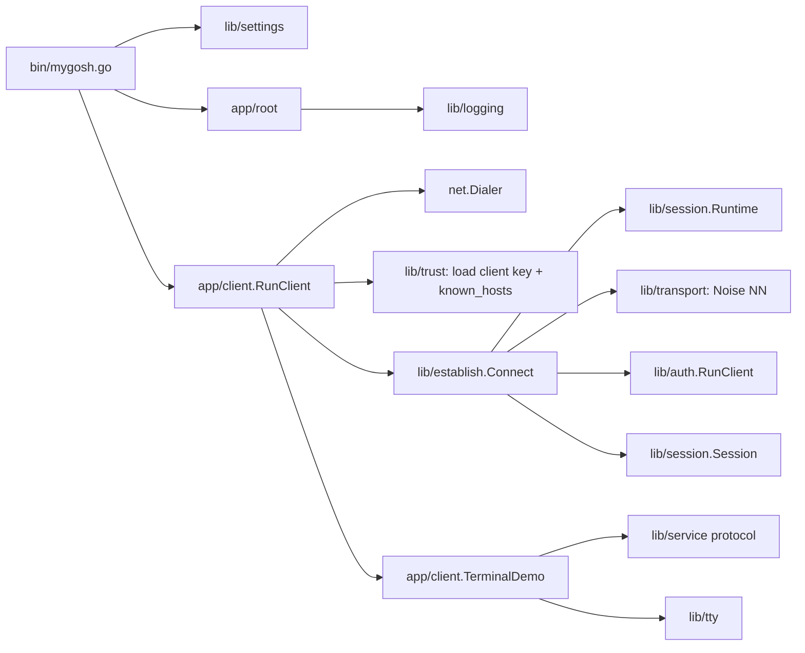
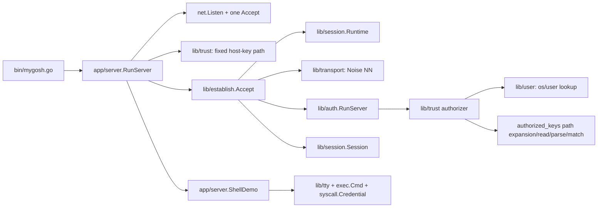
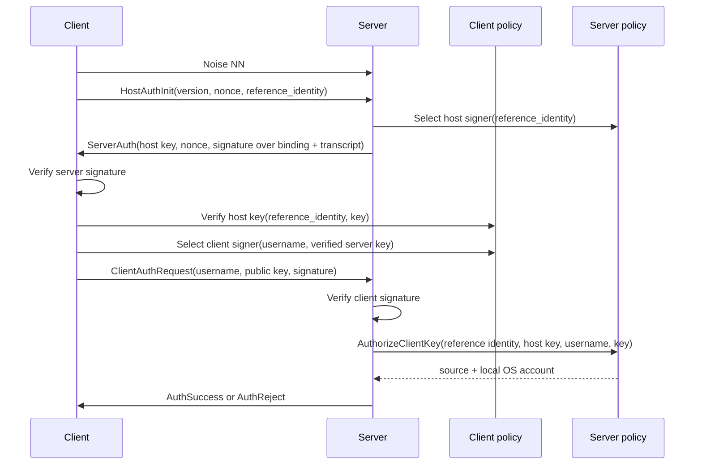
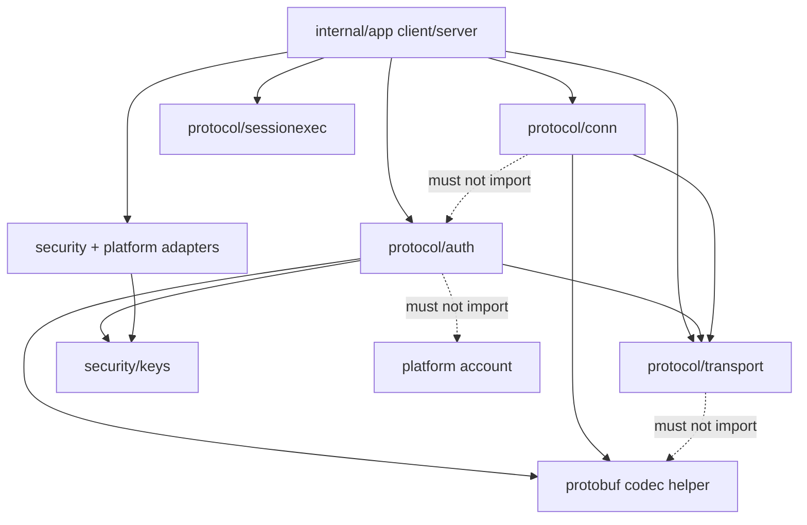
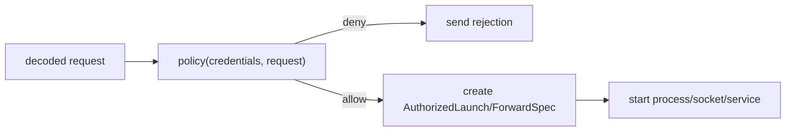
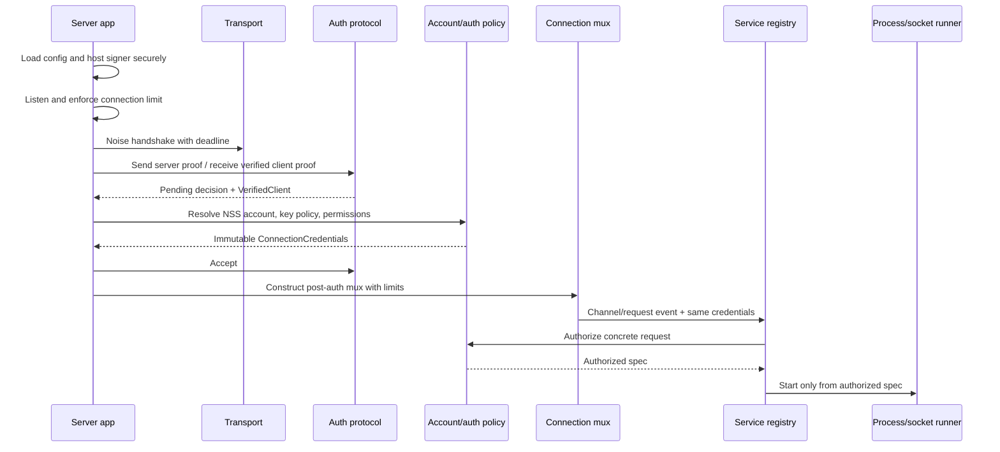

# `mygosh` architecture and code review

> Review date: 2026-06-20  
> Reviewed revision: `1763eb1` (`master`)  
> Scope: all tracked Go, protobuf, build, container, shell, and Python code. Generated protobuf files were checked for provenance and correspondence with their source schemas; findings refer to the schemas and handwritten call sites rather than generated boilerplate.

## Executive summary

`mygosh` has a credible protocol core, but it is not yet a secure or operational SSH replacement. The best parts are worth preserving:

- Noise establishes a confidential channel before credentials are sent.
- The server proof is bound to the Noise transcript, host-auth request, host key, and nonce.
- The client verifies the server signature and local host-key policy before signing its own proof.
- The client proof is bound to the same channel and transcript.
- Authentication and post-authentication protobuf schemas are separate.
- Post-authentication traffic has one receive loop, channel IDs, request IDs, and flow-control windows.
- Terminal bytes are preserved exactly.
- `strictfiles` is a useful start toward safe credential-file access.

The main problem is not one bad abstraction. It is that several layers each own half of the same responsibility:

- `app` chooses some paths and owns TCP, but `lib/trust` chooses other paths, performs NSS lookup, reads files, parses files, evaluates authorization, logs policy decisions, and returns an OS account.
- `lib/auth` implements the wire proof protocol, but also defines server authorization and imports the Unix account model.
- `lib/session` implements the post-auth multiplexer, but also owns handshake/authentication timeout and connection-lifetime machinery.
- `lib/establish` composes the layers, but its result exposes mutable authentication and account data beside a session that can also be constructed directly without authentication.
- `lib/service` is called a generic service package, but currently describes one specific command/PTY channel protocol.

The desired security invariant should be:

> A post-authentication connection can be created only after server identity verification, client proof verification, local account resolution, account/authentication policy, and connection-level permission calculation have all succeeded. A concrete service request must then be authorized before it allocates a PTY, starts a process, opens a socket, or otherwise performs the service.

The current production path mostly follows that order, but the package APIs do not enforce it, the authorization result is not validated before auth success, and service/channel lifecycle bugs can violate the intended behavior.

### Overall assessment

| Area | Assessment |
|---|---|
| Cryptographic transcript | Good foundation; retain with focused hardening and tests |
| Transport framing | Small and understandable; responsibility and limit cleanup needed |
| Authentication API | Correct sequence, wrong policy boundary |
| Trust/account lookup | Not safe enough for a privileged daemon; substantial refactor needed |
| Session multiplexer | Promising, but currently vulnerable to callback deadlocks and resource exhaustion |
| PTY/exec demo | Useful prototype, not a safe service implementation yet |
| Server lifecycle | Demo-only: accepts one connection and exits |
| Tests | Healthy basic suite, but weak around malicious peers, lifecycle edges, and trust integration |
| v1 direction | Feasible without a rewrite if boundaries are fixed before adding features |

---

## Verification performed

The worktree was clean before this report was added.

The following passed:

```text
go test ./...
go test -race ./...
go vet ./...
go test -shuffle=on -count=10 ./...
go test -count=20 ./lib/session ./lib/establish ./app/server
go mod verify
```

Coverage from `go test -coverprofile=... ./...` was **43.3% of handwritten and generated statements combined**. Particularly relevant package results:

| Package | Statement coverage |
|---|---:|
| `lib/transport` | 83.2% |
| `lib/establish` | 82.2% |
| `lib/trust` | 82.8% |
| `lib/strictfiles` | 87.5% |
| `lib/session` | 60.9% |
| `app/server` | 67.2% |
| `app/client` | 23.5% |
| `lib/auth` direct package tests | 9.5% |
| `lib/tty` | 0% |
| `bin` | 0% |

The low direct `lib/auth` number understates integration coverage because `lib/establish` exercises authentication, but it accurately shows that malformed and adversarial auth state transitions are barely tested in the auth package itself.

`gofmt -d` reports two formatting issues:

- an extra blank line at the end of [`lib/transport/algos.go`](lib/transport/algos.go)
- spacing and a missing final newline in [`lib/user/id_convert.go`](lib/user/id_convert.go)

One existing session test takes exactly ten seconds:

```text
TestSessionRunRejectsUnknownChannelData (10.00s)
```

That is not merely a slow test. [`protocolErrorf`](lib/session/session.go#L763) synchronously writes a disconnect while the peer is not reading. `net.Pipe` blocks until its ten-second deadline. This demonstrates the broader blocking-write/receive-loop problem described in finding S1.

---

## Current architecture, reconstructed from code

### Actual client path



In order:

1. The CLI always loads `mygosh.toml` from the current directory.
2. `app/client` parses `[user@]host[:port]` and dials TCP.
3. `lib/trust` expands fixed default paths and loads an OpenSSH private key and `known_hosts`.
4. `lib/establish` creates a `session.Runtime`, performs Noise, runs auth, and constructs a mux.
5. `TerminalDemo` starts the mux receive loop, opens a `"session"` channel, requires PTY then exec, makes local stdin raw, and forwards bytes and resize events.

### Actual server path



In order:

1. The server listens and accepts exactly one connection.
2. It loads the host key after accepting that connection.
3. `lib/establish` performs Noise and auth.
4. During `lib/auth.RunServer`, a callback in `lib/trust`:
   - looks up the client-supplied username through `os/user`;
   - expands two configured `authorized_keys` paths against that account;
   - reads and parses the files;
   - matches the proved key;
   - returns a local `user.Account`.
5. Auth sends success.
6. `ShellDemo` starts the mux, allows one `"session"` channel, requires PTY then exec, and starts `shell -c <client command>` under the returned account.

### Current auth exchange



The ordering is basically right. The problem is that the server policy operation and its result type live inside the protocol package.

### Where ownership is currently blurred

| Responsibility | Current owner(s) | Problem |
|---|---|---|
| TCP dial/listen | `app/client`, `app/server` | Correct in principle, but close ownership is duplicated by app, transport, runtime, and session |
| Noise handshake | `lib/transport` | Reasonable |
| Handshake/auth timeout | `lib/session.Runtime`, called by `lib/establish` | Post-auth package owns pre-auth lifecycle |
| Protobuf codec | `lib/transport` | Transport imports protobuf and schema validation despite claiming to be a framed secure transport |
| Host key selection | `lib/auth` interface, implemented from app | Reasonable seam, overdesigned for one fixed key |
| Client identity selection | `lib/auth` interface, implemented from app | Reasonable seam |
| Host trust | `lib/auth` interface, `lib/trust` path/file implementation | Path choice and file access should be app composition; matching/parser primitives can be library code |
| Client authentication proof | `lib/auth` | Correct |
| Username-to-account mapping | `lib/trust` through `lib/user` | Deployment policy hidden inside a “trust” library |
| `authorized_keys` path policy | partly `app/server`, mostly `lib/trust` | App passes strings, library expands account home and decides lookup behavior |
| Connection permissions | absent | Key match currently implies full PTY/exec login |
| Post-auth mux | `lib/session` | Correct domain, though “connection” would be a clearer name |
| Command/PTY wire protocol | `lib/service` | Too generic a package name for a specific protocol |
| Process policy and launch | `app/server` | Correct layer, but it receives an under-specified mutable account rather than authorized launch data |

---

## What should be retained

This review is not a recommendation to discard the protocol.

### Auth transcript construction is directionally strong

[`lib/auth/payloads.go`](lib/auth/payloads.go) and [`lib/auth/transcript.go`](lib/auth/transcript.go) use deterministic protobuf encoding only for signed/transcript material. The server signature binds:

- a context string;
- the Noise channel binding;
- the hash of the client host-auth initiation;
- the server host key;
- a server nonce.

The client signature additionally binds:

- the server-auth hash;
- the username;
- the client public key;
- the signature algorithm.

This prevents a proof from being replayed onto another Noise connection and avoids signing ambiguous ad-hoc concatenations.

### The authentication ordering protects client credentials

[`authenticateClient`](lib/auth/client_auth.go#L26) verifies the server signature and calls host-key verification before selecting or using the client signer. That is the right invariant.

On the server, [`authenticateServer`](lib/auth/server_auth.go#L25) verifies the client signature before NSS lookup and `authorized_keys` evaluation. That avoids treating an unproved key claim as authenticated input.

### Schema separation is good

The auth and post-auth messages have separate top-level oneofs in:

- [`proto/auth/auth.proto`](proto/auth/auth.proto)
- [`proto/session/session.proto`](proto/session/session.proto)

`protovalidate` is applied on both send and receive. This is a solid base for explicit protocol phases.

### The mux has useful fundamentals

The session code already has:

- one receive loop;
- independent local and peer channel IDs;
- per-channel flow-control windows;
- max packet sizes;
- request/reply correlation;
- exact byte preservation;
- a clean reject-by-default handler.

The implementation needs lifecycle and adversarial hardening, not wholesale replacement.

### Explicit loggers are preferable to globals

The code passes `*slog.Logger` through most seams and does not mutate `slog.Default`. Keep that property even if logging construction moves out of `lib`.

---

## Findings

Severity meanings:

- **Blocker**: incompatible with a secure, functional v1 daemon.
- **High**: exploitable security/liveness issue or a boundary that will make upcoming features unsafe.
- **Medium**: important correctness, maintainability, or defense-in-depth issue.
- **Low**: localized cleanup or polish.

### Summary

| ID | Severity | Finding |
|---|---|---|
| A1 | Blocker | `lib/auth` combines cryptographic authentication with OS authorization and account data |
| A2 | High | Auth success is sent without validating that the returned account/permissions are usable |
| T1 | Blocker | Credential and trust files bypass `strictfiles`; reads are unchecked and unbounded |
| T2 | High | Trust-file semantics are incomplete and sometimes security-significant |
| T3 | High | Detailed authorization/NSS/file errors are disclosed to unauthenticated clients |
| S1 | Blocker | Session callbacks and protocol-error writes can block the sole receive owner |
| S2 | High | The mux has no connection-wide resource limits and permits cheap memory/ID exhaustion |
| S3 | High | Channel state permits invalid ordering, duplicate peer IDs, data after EOF, and leaked waiters |
| E1 | Blocker | The server accepts one connection and exits |
| E2 | High | Connection ownership and lifecycle are split across four layers |
| P1 | High | Exec can start without a cleanup path when `want_reply=false` |
| P2 | High | Channel/process completion contains several indefinite-wait paths |
| P3 | High | Process cancellation does not robustly own the whole child process group |
| C1 | High | “Authenticated credentials” are mutable snapshots and are not carried by the session type |
| C2 | Medium | Connection-level permissions and concrete request authorization do not exist |
| N1 | Medium | Network endpoint, server identity, and client-supplied reference identity are conflated |
| X1 | Medium | Transport contains protobuf/logging concerns and exposes mutable algorithm globals |
| K1 | Medium | Key identity includes mutable slices/comments and fingerprints omit the algorithm |
| D1 | Medium | The terminal client can leave a goroutine blocked reading stdin after return |
| D2 | Medium | The command service is PTY-only and runs a client-selected command through a global shell |
| B1 | Medium | Test/build automation misses the highest-risk behavior |
| L1 | Low | Repeated `WithLogger` APIs and package names reflect missing composition objects |

### A1 — `lib/auth` owns deployment authorization and Unix accounts

**References**

- [`ClientKeyAuthorizationResult`](lib/auth/auth.go#L128)
- [`ClientKeyAuthorizer`](lib/auth/auth.go#L133)
- `lib/auth` importing [`lib/user`](lib/auth/auth.go#L12)
- [`AuthorizedKeysClientKeyAuthorizerWithLogger`](lib/trust/user_lookup.go#L42)

The wire protocol needs a decision before it sends success, but it does not need to know what a Unix account is. The current interface makes `lib/auth` the owner of:

- local account mapping;
- key authorization;
- authorization source metadata;
- the object later used to set process credentials.

That is why names such as `AuthorizedKeysClientKeyAuthorizerWithLogger` have appeared: one constructor is trying to express protocol role, file format, policy source, account lookup, logging, and adapter shape.

The protocol should expose a **verified client proof** and a one-shot pending decision. Server composition should resolve that proof to immutable connection credentials, then tell the auth exchange to accept or reject.

`lib/auth` should not import:

- `lib/user`;
- filesystem packages;
- account policy;
- service permissions.

### A2 — Auth success does not guarantee readiness

**References**

- [`AuthorizeClientKey` result accepted on nil error](lib/auth/server_auth.go#L158)
- [`sendClientAuthOK`](lib/auth/server_auth.go#L169)
- account completeness checked only later in [`ShellDemo.Run`](app/server/shell_demo.go#L48)

Any `ClientKeyAuthorizer` can return a zero or incomplete result with `nil` error. `lib/auth` then sends success. The server may subsequently discover that it cannot create services for that account and close the connection.

That breaks a valuable protocol contract:

> Auth success should mean that the server has completed all mandatory connection-level authentication, account, and policy work and is ready to process post-auth messages.

The current demo authorizer returns a real account, but the API permits invalid successful results and there is no central validation.

The fix is not to teach `lib/auth` how to validate Unix accounts. The server policy layer should construct and validate a `ConnectionCredentials` object before calling `Accept`.

### T1 — Security-sensitive files are read with ordinary `os.ReadFile`

**References**

- [`ReadAuthorizedKeys`](lib/trust/authorized_keys_ssh.go#L12)
- [`ReadKnownHosts`](lib/trust/known_hosts_ssh.go#L14)
- [`ParseOpensshPrivateKeyFile`](lib/keys/openssh_key.go#L19)
- `strictfiles` has no callers outside its own tests

Current reads do not enforce:

- file owner;
- directory owner;
- group/other writability;
- symlink policy;
- regular-file type;
- maximum file size;
- race-resistant path traversal.

This is particularly important for a root server reading user-selected account homes and for the host private key. The repository already contains most of a safe-open primitive, but none of the production trust code uses it.

Unbounded `os.ReadFile` also gives an unauthenticated client a memory/CPU lever: request an existing username whose `authorized_keys` path points to a very large file.

The correct boundary is:

1. `app/server` chooses path templates and strict-mode policy.
2. A secure-file primitive opens and pins an app-supplied path or directory-relative name with size/owner/mode checks.
3. A parser consumes an `io.Reader` or bounded bytes.
4. A pure matcher evaluates parsed entries.

The parser must not choose the path. The app must not reimplement key parsing.

### T2 — Trust-file semantics are incomplete

**References**

- [`ParseAuthorizedKeys`](lib/trust/authorized_keys_ssh.go#L20)
- [`ParseKnownHosts`](lib/trust/known_hosts_ssh.go#L22)
- [`KnownHostsHostKeyVerifierWithLogger`](lib/trust/known_hosts_verifier.go#L18)

Specific issues:

1. Any `authorized_keys` entry with options is silently skipped. Common entries using `restrict`, `command=`, `no-pty`, or forwarding restrictions therefore do not work. For a secure service, these options should become constraints, not disappear.
2. An unrecoverable or trailing malformed entry can abort the whole file after earlier valid entries were parsed. The chosen compatibility/error policy should be explicit and tested.
3. `known_hosts` matching is exact string lookup. Wildcards, negation, hashed hosts, and `[host]:port` identities are parsed as strings but never interpreted.
4. `@cert-authority` is not rejected or implemented; it is treated like an ordinary host-key entry.
5. `@revoked` entries are skipped rather than recorded as an overriding rejection. If the same key is also present in an ordinary entry, it can still be accepted.
6. Both parsers currently depend on `golang.org/x/crypto/ssh`. That is factual use of a Go SSH library, even though only file-format parsers are used. Either explicitly narrow the project rule to allow format compatibility helpers, or replace this with small streaming parsers.

For an initial v1, it is acceptable to support a strict subset. Unsupported markers/options should fail explicitly or be represented as unsupported constraints, not acquire accidental semantics.

### T3 — Internal authorization errors are sent to the peer

**References**

- [`sendClientAuthReject(..., err.Error())`](lib/auth/server_auth.go#L163)
- detailed errors from [`AuthorizedKeysClientKeyAuthorizerWithLogger`](lib/trust/user_lookup.go#L49)

The client can distinguish:

- nonexistent local user;
- no authorized keys;
- key mismatch;
- unreadable or malformed files;
- concrete path and parser failures.

This enables user enumeration and leaks server configuration details. Detailed causes belong in server logs. The peer should receive a stable public code and generic message such as `authentication failed`.

The same principle should apply to protocol errors: avoid echoing implementation details that are not necessary for interoperability.

### S1 — The receive owner can deadlock on callbacks and writes

**References**

- synchronous handler calls in [`handleChannelOpen`](lib/session/session.go#L320), [`handleChannelRequest`](lib/session/session.go#L527), and [`handleGlobalRequest`](lib/session/session.go#L628)
- synchronous protocol-error send in [`protocolErrorf`](lib/session/session.go#L763)
- write path has no context in [`sendEnvelope`](lib/session/session.go#L739)

`Session.Run` is the only receive owner, but it calls application handlers synchronously. If a handler calls `SendRequest(..., wantReply=true)`, it waits for a result that only `Session.Run` can receive. That is a direct self-deadlock.

Even a non-waiting handler can block the entire connection on:

- NSS, disk, PAM, or process startup;
- a channel send whose peer is not reading;
- a disconnect/protocol-error write;
- arbitrary handler code.

The ten-second existing test described earlier proves the protocol-error variant.

Recommended model:

- Keep exactly one frame decoder/dispatcher.
- Never let it synchronously wait for an application operation or network reply.
- Dispatch accepted events to bounded per-channel workers/queues.
- Serialize outgoing frames through a writer owner with cancellation and a bounded queue, or apply explicit write deadlines.
- Define whether handler methods may call channel methods. Make reentrancy safe or reject it by API design.
- On fatal protocol errors, attempt a bounded best-effort disconnect, then close. Never wait indefinitely to explain an error.

### S2 — Resource use is not bounded at the connection level

**References**

- unlimited channel map in [`Session`](lib/session/session.go#L27)
- queued channel frames in [`Channel.frames`](lib/session/channel.go#L47)
- pending request maps in [`Session`](lib/session/session.go#L37) and [`Channel`](lib/session/channel.go#L45)

Per-channel byte windows are useful, but an authenticated peer can still create:

- unlimited channels;
- unlimited pending channel/global requests;
- unlimited empty `ChannelData` frames, which consume no window;
- repeated rejected opens that consume monotonically increasing IDs;
- many channels each with a full receive window;
- large control payloads up to the transport frame limit.

For v1, add configurable hard limits:

- max channels per connection;
- max pending opens;
- max outstanding requests globally and per channel;
- max queued frames and bytes per channel and connection;
- max control payload/string lengths;
- max auth attempts;
- optional idle and request deadlines.

Reject empty data frames or count them against a frame budget.

### S3 — Channel state has protocol and cleanup holes

**References**

- incoming channels are marked open before acceptance in [`newIncomingChannel`](lib/session/channel.go#L72)
- handler receives that channel before it is inserted in the session map in [`handleChannelOpen`](lib/session/session.go#L320)
- peer channel IDs are not tracked for uniqueness
- data handling does not reject `eofReceived` in [`handleChannelData`](lib/session/session.go#L427)
- canceled request waiters remain in maps in [`SendRequest`](lib/session/channel.go#L215) and [`SendGlobalRequest`](lib/session/session.go#L224)

Consequences:

- `OnChannelOpen` can use a channel before the acceptance response has been sent.
- A handler can send data or requests before the peer knows the local channel ID.
- A malicious peer can reuse its sender channel ID across opens, making outbound addressing ambiguous.
- Data after EOF is accepted.
- Context cancellation returns to the caller but leaves the pending waiter until a result or session shutdown.
- A failed channel-open acceptance send relies on whole-session shutdown for rollback rather than cleaning up the channel locally.
- Window credit is consumed before a send; a send failure does not restore it or consistently fail the session.

Model channel state explicitly:

```text
opening -> open -> local-eof / remote-eof -> closing -> closed
           \-> failed
```

Validate every frame against that state and maintain a set of active peer IDs.

### E1 — The server is a one-connection demo

**Reference**

- one [`listener.Accept`](app/server/server.go#L45), followed by return

A v1 daemon needs:

- an accept loop;
- one goroutine/task per connection;
- a concurrency limit;
- per-IP or global handshake throttling;
- graceful shutdown that stops accepting and waits for active connections;
- startup loading/validation of host keys and configuration;
- panic containment at the connection boundary;
- connection IDs for logs/audit;
- temporary accept-error handling/backoff.

This should remain app-owned. None of it belongs in `lib/transport`.

### E2 — Connection close ownership is duplicated

**References**

- app defers raw connection close in [`RunClient`](app/client/client.go#L47) and [`RunServer`](app/server/server.go#L52)
- `Transport.Close` closes the same socket
- `session.Runtime` closes a replaceable target
- `Session.Close` closes the runtime/transport

Multiple idempotent closes usually work, but ownership is unclear and error reporting is lossy. More importantly, the object responsible for handshake/auth timeouts lives in `lib/session`.

Use one connection-lifecycle owner in a neutral package or in establishment composition:

```text
raw net.Conn -> secure transport -> authenticated connection mux
```

Ownership transfers at each successful phase. On failure, the current owner closes. On success, only the final established connection is closed by the app.

### P1 — `want_reply=false` exec starts a process but never starts its runtime

**References**

- process is started inside [`startRemotePTYProcess`](app/server/shell_demo.go#L375)
- forwarding is deferred to [`OnRequestReplied`](app/server/shell_demo.go#L214)
- `OnRequestReplied` is only invoked when the request wanted a reply in [`handleChannelRequest`](lib/session/session.go#L548)

`pty.StartWithSize` starts the child immediately. For an exec request with `want_reply=false`:

1. the child starts;
2. `OnRequest` returns success;
3. no reply is sent;
4. `OnRequestReplied` is never called;
5. forwarding and wait/cleanup goroutines never start.

The service must either require replies for state-changing start requests or decouple “reply successfully written” from process creation without losing cleanup ownership. A good rule is:

> Validate and authorize the request, reserve resources, send acceptance, then start the service under an owner that is guaranteed to wait and clean up.

If process creation itself must occur before acceptance, cleanup must already be active before the process starts.

### P2 — Channel/process completion can wait forever

**References**

- channel close before exec does not finish the handler in [`OnClose`](app/server/shell_demo.go#L237)
- completion requires both process finish and peer close in [`shouldFinishLocked`](app/server/shell_demo.go#L358)
- server sends close but waits for the peer to close in [`forwardOutputAndWait`](app/server/shell_demo.go#L472)

Examples:

- A peer opens the one allowed channel, closes it before exec, and leaves the connection open. `channelAccepted` remains true and `done` is never completed.
- A process exits and the server sends EOF/close, but a malicious peer never returns close. The server waits indefinitely.
- EOF from the client kills the process rather than representing a half-close of stdin.
- Post-auth writes have no deadline, so exit-status or close can block cleanup.

Channel closure must have a locally enforceable terminal state. A peer acknowledgment can improve graceful shutdown but cannot be required forever.

### P3 — Process-tree ownership is incomplete

**References**

- [`exec.CommandContext`](app/server/shell_demo.go#L386)
- [`remotePTYProcess.stop`](app/server/shell_demo.go#L443)

`CommandContext` kills the direct process when canceled. The PTY helper creates a new session, and closing the PTY often causes hangup behavior, but the code does not explicitly own or terminate the whole process group. Descendants may survive or cleanup may depend on shell behavior.

For the service runner:

- record the child process group/session;
- define graceful signal then forced-kill behavior;
- always call `Wait`;
- close all PTY ends exactly once;
- bound shutdown time;
- treat connection loss as cancellation;
- test a command that forks descendants.

This runner is also the likely future process-separation boundary.

### C1 — Per-connection credentials are mutable and not attached to the connection

**References**

- exported byte slices in [`keys.PublicKey`](lib/keys/keys.go#L31) and [`keys.Keypair`](lib/keys/keys.go#L37)
- mutable group slice in [`user.Account`](lib/user/user.go#L21)
- auth results stored beside the embedded session in [`establish.Server`](lib/establish/server.go#L25)
- public [`session.New`](lib/session/session.go#L48) accepts any framed connection

Callers can mutate key bytes or supplementary groups after “authentication.” `NewKeypairSigner` also shallow-copies the keypair and therefore shares its slices with the caller.

The mux itself has no authenticated credential. It can be constructed directly after anonymous Noise, as the tests do.

Recommended invariant:

- Only establishment can create the post-auth connection exposed to services.
- Server establishment returns an object containing an immutable `ConnectionCredentials`.
- Fields with slices/bytes are private or copied on access.
- Services receive the same credentials pointer/snapshot for the connection lifetime.
- The generic mux remains unaware of Unix accounts, but app code cannot accidentally pair a mux with different credentials.

### C2 — There is no permissions model

Today, a matching key grants the ability to run any client-supplied command with a PTY as the mapped account. There is no representation for:

- shell allowed/denied;
- exec allowed/denied;
- PTY allowed/denied;
- forced command;
- permitted environment variables;
- channel count;
- port-forwarding rules;
- source-address constraints;
- authorized-key options.

Not every concrete decision can happen during connection auth because the command or forwarding target is not known yet. The clean split is:

1. **Before auth success:** resolve account and immutable broad permissions/constraints.
2. **Before a service starts:** authorize the concrete request against those constraints.
3. **Service runtime:** consume an already-authorized launch/forward specification; do not redo identity authentication.

### N1 — Endpoint and identity are conflated

**References**

- [`connectTarget.referenceIdentity`](app/client/target.go#L104)
- `ReferenceIdentity` sent by the client and returned as a server auth fact

The dial host, host-key lookup identity, optional virtual-host selector, and audit identity are distinct concepts.

Current behavior:

- excludes the port from host identity;
- performs exact case-sensitive matching;
- does not normalize trailing dots, IPv6 forms, or IDNA;
- lets the client tell the server its own “reference identity”;
- includes that client-supplied value in the server auth result.

For a minimal one-host-key server, the server does not need the client to send this value at all. For virtual hosting, call it `server_name`, validate it against listener configuration, and treat it as an input selector rather than an authenticated server fact.

### X1 — Transport owns too much and exposes mutable protocol choices

**References**

- generic protobuf helpers in [`lib/transport/proto.go`](lib/transport/proto.go)
- logging dependency in [`lib/transport/transport.go`](lib/transport/transport.go)
- exported mutable globals in [`lib/transport/algos.go`](lib/transport/algos.go)

Recommended split:

- `transport`: Noise handshake, encrypted frame send/receive, close/deadline/exporter.
- `wireproto` or each protocol package: protobuf marshal, validation, and message limits.
- app/composition: logger decoration and phase logging.

The Noise suite should be immutable internal configuration. Mutable exported package globals permit accidental runtime mutation and data races.

`MaxPayloadSize` is also ambiguous: it limits encrypted chunks, while `SendFrame` accepts plaintext and adds an authentication tag before applying that limit. A plaintext exactly `MaxPayloadSize` therefore cannot be sent. Define separate maximum plaintext and maximum ciphertext sizes and test the public boundary.

Handshake functions should reject a nil connection and return `nil, err`, not a partially initialized `*Transport` on failure.

### K1 — Key identity and key material need a tighter model

**References**

- [`PublicKey.MarshalBinary`](lib/keys/keys.go#L222)
- [`FingerprintSHA256`](lib/keys/keys.go#L291)
- panic-based signing in [`lib/keys/signing.go`](lib/keys/signing.go)

Issues:

- Comments are serialized into protocol key blobs. Comments are presentation metadata, not key identity.
- Fingerprints hash only key bytes, not an algorithm-tagged canonical key encoding.
- Mutable slices are exposed.
- Signing and verification panic for unsupported key types rather than returning errors.
- private-key file reads are unbounded before the parser's 16 KiB cursor limit applies.
- encrypted OpenSSH private keys are unsupported, which is acceptable for a first server key but weak for client usability.

Use a canonical algorithm-tagged public-key encoding without comments. Hash that for fingerprints. Keep comments only in parsed file entries.

### D1 — Terminal input can outlive `TerminalDemo.Run`

**Reference**

- blocking [`input.Read`](app/client/terminal_demo.go#L222)

Canceling `runCtx` does not interrupt a blocking read from `os.Stdin`. If the remote process exits while the user has not typed anything, `TerminalDemo.Run` can return and restore the terminal while the input goroutine remains blocked. It may later consume input intended for the caller's restored shell/process.

Use an interruptible input strategy:

- poll/select on a duplicated file descriptor plus cancellation;
- close a dedicated duplicate rather than global stdin;
- or centralize terminal I/O in one lifecycle owner.

### D2 — The command service is not yet a shell/exec design

Current behavior always:

1. requires a PTY;
2. receives an `ExecRequest`;
3. runs configured `shell -c command`.

When no command is supplied, the **client's** `core.shell` string becomes the remote command. That is not an interactive-shell request.

A v1 session channel should support:

- optional PTY request;
- exactly one of `shell` or `exec`;
- non-PTY exec for automation;
- account/config-selected shell for `shell`;
- stdout and stderr distinction for non-PTY exec;
- exit status and exit signal;
- filtered environment requests;
- window changes only after PTY acceptance.

The package should be named for this protocol, for example `sessionexec`, not generic `service`.

### B1 — Automation does not target the risky paths

Observations:

- `Taskfile.yml`'s `dev` task builds and runs an unpinned `golangci-lint`, but does not run `go test ./...`.
- No CI workflow is checked in.
- No fuzz tests cover binary key parsing, protobuf ingress, `known_hosts`, or `authorized_keys`.
- Auth's malformed-state behavior is barely tested directly.
- `lib/tty` has no package tests.
- The shell integration test creates an anonymous Noise session directly; it does not integrate trust, auth, account resolution, and process launch.
- Session tests do not cover duplicate IDs, data-after-EOF, canceled pending requests, callback reentrancy, empty-frame floods, or resource limits.

Add fuzzers and adversarial `net.Pipe` tests before expanding the wire protocol.

### L1 — API naming is exposing composition leakage

Examples:

- `KnownHostsHostKeyVerifierWithLogger`
- `AuthorizedKeysClientKeyAuthorizerWithLogger`
- `LookupClientIdentityWithLogger`
- `HandshakeClientWithLogger`

The logger suffix is not the primary problem. These functions combine too many decisions.

Prefer:

```go
entries, err := authorizedkeys.Parse(reader)
decision := authorizedkeys.Match(entries, provedKey)
```

and let the app log around those operations. For constructors that genuinely need dependencies, use a small config:

```go
type VerifierConfig struct {
    Store  HostKeyStore
    Logger *slog.Logger
}
```

Do not multiply paired `Foo`/`FooWithLogger` APIs across every package.

---

## Additional package-level observations

### `bin`, settings, and app root

- [`settings.Load`](lib/settings/settings.go#L33) requires `mygosh.toml` in the current working directory. Client and server configuration should be separate app concerns with explicit path selection and usable defaults.
- `CoreSettings.Shell` serves unrelated client and server meanings.
- `lib/settings` and `lib/logging` are application infrastructure, not reusable protocol libraries.
- `lib/logging` imports `lib/settings`, which reverses the more reusable dependency direction.
- [`openLogFile`](lib/logging/logger.go#L44) follows symlinks and then `chmod`s the target. With privileged execution and a bad configured path, that can alter an unintended file.
- [`main`](bin/mygosh.go#L20) uses an unbounded `context.Background()` for shutdown. Future shutdown hooks can hang process exit.
- `Root.Shutdown` can execute registered callbacks more than once; the current logging callback is idempotent, future callbacks may not be.

### Client target parsing

- The parser is readable and covers bracketed IPv6.
- Port strings are not validated as numeric; service names are implicitly accepted by `net.Dial`.
- The default username comes from the mutable `USER` environment variable rather than a local account lookup/config.
- Username and hostname canonicalization are absent.
- Host identity omits non-default ports.

These are mostly app semantics, but they must be settled before `known_hosts` becomes a security boundary.

### Auth protocol details

- `sendAuthError` and `sendClientAuthReject` ignore send failures. Make rejection best-effort and preserve the primary local error, but record whether the response was delivered.
- Provider callbacks can return a nil `Signer` with nil error, causing a panic on method use. Validate callback results.
- Username and reference identity only have minimum-length validation. Add conservative maxima.
- There is one client-key attempt per connection. A practical v1 client with several agent/file identities needs bounded retry or method negotiation.
- Public auth errors should carry stable codes; local wrapped errors should remain local.
- The state machine is useful documentation but has little adversarial state-transition test coverage.

### Transport and framing

- `tx_mux` plus `writeMu` is redundant locking for normal frame sends.
- Field and constant naming is not idiomatic Go (`tx_mux`, `MYGOSH_NOISE_MAGIC`, mutable `ORDER`).
- [`bincoder.ORDER`](lib/bincoder/rw.go#L11) is an exported mutable variable. Make byte order internal and immutable.
- `Encoder.Result` and `Decoder.Rest` expose internal/backing slices. Current callers mostly clone, but safer APIs should make ownership explicit.
- Length-prefix allocation is bounded for transport frames, which is good.
- There is no idle timeout after auth. Add app-configurable connection and request policies rather than hiding them in transport.

### Session mux

- `Run` treats raw EOF as a clean successful end. An abrupt transport loss and a graceful protocol shutdown should be distinguishable for auditing and service cleanup.
- `OnDisconnect` is an arbitrary synchronous callback in a defer. A panic or block there can destabilize connection teardown.
- Received `ChannelClose` is not automatically acknowledged; handlers/app code must cause local close.
- Request IDs and channel IDs do not handle wraparound/collision. Limits make practical wraparound impossible and simplify the rule.
- `sendEnvelope` does not automatically fail the connection on a write error, leaving individual callers to decide inconsistently.

### Trust, account, and strict files

- `lib/trust` currently means four things: file formats, filesystem access, policy adapters, and account lookup. Split it.
- `GatherAuthorizedKeys` and `matchAuthorizedKey` duplicate traversal logic.
- Errors in an earlier configured file are ignored if a later file matches. Whether this is fail-open or intended fallback should be explicit policy.
- `user.GUID` is presumably a typo for `GID`.
- `user.Account` omits the login shell and account status needed for a real login service.
- `os/user` can use NSS with cgo, but its `User` type does not expose the passwd shell. A proper Unix account adapter will likely need `getpwnam_r`/`getgrouplist` or another deliberate NSS binding.
- `strictfiles.OpenDir` hardcodes effective UID as the expected owner, so a root daemon cannot use it as-is to anchor a user-owned home directory.
- The `openat2` fallback occurs only for `ENOSYS`; older kernels can reject resolve flags with other compatibility errors.
- Intermediate directory ownership/mode policy is not checked in the fallback.
- `CheckedFile` is copyable despite owning an fd and is not concurrency-safe. Prefer a pointer-only constructor and unexported fields, with `runtime.SetFinalizer` avoided as an ownership substitute.

### Keys

- The custom X25519 keypair format is currently unrelated to the Noise NN transport, which generates ephemeral keys internally.
- `MustParseKeypairBase64` is fine for constants/tests but should not enter config-driven paths.
- OpenSSH PEM parsing ignores trailing PEM/data after the first block.
- `dump.py` prints complete private key material and the Ed25519 seed. Keep it clearly quarantined as a development forensic tool or remove it before users can mistake it for a normal command.

### PTY and process code

- `VTTY` itself is small and appropriately Unix-specific.
- The large comment in [`lib/tty/vtty.go`](lib/tty/vtty.go#L19) describes future policy that belongs in process-runner design docs, not the low-level PTY wrapper.
- Process startup happens while the mux receive loop is inside a handler.
- `TERM` has no maximum and can be empty.
- The environment is intentionally sparse, which is a good default, but login environment construction needs a policy seam.
- Remote nonzero exit is converted to a generic client error, so the CLI exits with status 1 rather than the remote status.

### Build and repository support

- The generated protobuf files are normal `protoc-gen-go v1.36.11` output and correspond to the checked-in schemas.
- The Docker build regenerates protobufs, which is good for consistency.
- The repository uses Go SSH code through `golang.org/x/crypto/ssh` file parsers despite the stated intent to avoid Go SSH libraries.
- `github.com/samber/lo` is used for operations that are clearer with short ordinary loops; removing it would reduce dependency and indirection.

---

## Recommended architecture

### Design rules

1. **Protocol packages know protocol facts, not deployment policy.**
2. **The app chooses paths, listeners, accounts, policy sources, and services.**
3. **Filesystem primitives open what the caller specifies; parsers parse supplied streams.**
4. **Auth success is emitted only after connection credentials are complete and valid.**
5. **The post-auth mux is not exposed before auth success.**
6. **Services see immutable per-connection credentials.**
7. **Concrete requests are authorized before resource allocation or process/socket creation.**
8. **One goroutine owns reads; one bounded mechanism owns writes.**
9. **Every peer-controlled collection and payload has a limit.**
10. **Process cleanup never depends indefinitely on peer cooperation.**

### Suggested package map

The exact directory names are flexible. The dependency direction is the important part.

```text
cmd/mygosh/

internal/app/
  root/                 config, logging, shutdown
  client/               CLI semantics, dial, path selection, terminal UI
  server/               listen/accept loop, per-connection orchestration
  server/security/      NSS/PAM composition, key policy, credentials, permissions
  server/services/      channel registry and request authorization
  server/process/       PTY/non-PTY process runner and cleanup

protocol/
  transport/            Noise + encrypted frames only
  auth/                 auth wire state and cryptographic proofs
  conn/                 post-auth channel/request multiplexer
  sessionexec/          shell/exec/PTY request message types and codecs

security/
  keys/                 immutable key/signing primitives
  securefile/           fd-relative safe opens and metadata checks
  authorizedkeys/       streaming parser + constraints, no paths
  knownhosts/           streaming parser + matcher, no paths

platform/unix/
  account/              NSS account/group snapshot
  pty/                  low-level PTY operations
```

If the project is not intended to provide a stable public Go API yet, putting most of these under `internal/` is preferable. A folder named `lib` does not enforce a boundary in Go.

### Dependency direction



### Responsibility matrix

| Concern | Library primitive | App decision |
|---|---|---|
| TCP options and dialing | `net.Conn` compatibility | address, proxy, keepalive, bind, listener |
| Secure channel | Noise handshake and frame API | timeout, logging, accepted suite/version |
| Host key | signer interface | which key for this listener/server name, where loaded |
| Host verification | parsed-entry matcher | which files/stores, TOFU policy, prompt/UI |
| Client signing | signer interface | file, agent, hardware, identity order |
| Client proof | verify signature/transcript | map username/key to account |
| Account lookup | Unix/NSS adapter | whether account is permitted |
| Auth files | secure open + parser | path templates, strict mode, precedence |
| Permissions | plain constraint types | config/key/PAM policy intersection |
| Mux | channels, windows, requests | limits and registered channel types |
| Exec protocol | message codec/state helper | whether request is allowed |
| Process launch | Unix runner | authorized command, account, env, cwd, limits |
| Forwarding | socket/channel primitive | destination/listen policy |

---

## Authentication and credential API shape

### Keep protocol authentication staged

The server needs to verify a proof, pause for local policy, then send accept/reject. Model that explicitly:

```go
// protocol/auth
type VerifiedClient struct {
    Username       string
    PublicKey      keys.PublicKey
    KeyFingerprint string
    ChannelBinding [32]byte
    ServerName     string // only if virtual hosting is actually supported
}

type PendingServerAuth struct {
    // unexported wire/state fields
}

func ReceiveAndVerifyClient(
    ctx context.Context,
    conn BoundFramer,
    host Signer,
) (*PendingServerAuth, VerifiedClient, error)

func (p *PendingServerAuth) Accept(ctx context.Context) error
func (p *PendingServerAuth) Reject(ctx context.Context, failure PublicFailure) error
```

Properties:

- `PendingServerAuth` is one-shot.
- Closing it before a decision rejects or closes; orchestration should `defer` that close until acceptance succeeds.
- It owns no NSS/account/filesystem concepts.
- It exposes no post-auth mux.
- Public rejection is separate from the local detailed error.

Client auth can keep two narrow hooks because their timing is protocol-significant:

```go
type ClientHooks struct {
    VerifyHost   func(context.Context, ServerProof) (VerifiedHost, error)
    SelectSigner func(context.Context, VerifiedHost, string) (Signer, error)
}
```

The app builds these hooks from already-opened stores or narrowly scoped adapters.

### Server policy belongs in app composition

```go
// internal/app/server/security
type Authenticator interface {
    Authenticate(
        ctx context.Context,
        peer PeerInfo,
        proof auth.VerifiedClient,
    ) (*ConnectionCredentials, error)
}
```

That operation should:

1. validate/canonicalize the requested username;
2. resolve the account via NSS;
3. reject disallowed/locked accounts from config/account policy;
4. resolve app-configured key sources;
5. securely open and parse them;
6. match the proved key;
7. combine key constraints and server configuration;
8. run later PAM account/auth policy where applicable;
9. construct and validate immutable credentials.

Only then:

```go
pending.Accept(ctx)
mux := conn.New(secureTransport, limits)
handler := services.NewConnectionHandler(credentials, policy, runner)
return mux.Run(ctx, handler)
```

### Immutable per-connection credentials

Conceptually:

```go
type ConnectionCredentials struct {
    authentication Authentication
    account        AccountSnapshot
    permissions    ConnectionPermissions
}

type Authentication struct {
    Method         string
    RequestedUser  string
    KeyAlgorithm   string
    KeyFingerprint string
    Source         string
}

type AccountSnapshot struct {
    Username string
    UID      uint32
    GID      uint32
    Groups   immutableGroups
    HomeDir  string
    Shell    string
}

type ConnectionPermissions struct {
    AllowShell      bool
    AllowExec       bool
    AllowPTY        bool
    AllowForwarding bool
    ForceCommand    string
    MaxChannels     uint32
    // Future forwarding and environment constraints.
}
```

The concrete implementation should not expose mutable slices. Return copies or iterator/value views.

The credentials are a **snapshot**. They do not change if files or NSS change mid-connection. New channels use the same snapshot. If policy requires revocation of existing sessions, that is a separate active-session control feature.

---

## Where authorization should occur

The user's preference to decide permissions before services run is correct, with one necessary distinction.

### Connection-level decision: before auth success

Decide everything knowable from:

- network peer metadata;
- requested username;
- proved client key/certificate;
- resolved account;
- server config;
- key-entry constraints;
- PAM account policy.

Examples:

- account may log in;
- key is valid for this account;
- shell/exec/PTY/forwarding categories;
- forced command;
- max channels;
- source restrictions;
- environment allowlist;
- broad forwarding restrictions.

### Request-level decision: before resource creation

Some facts do not exist until a channel/request arrives:

- the exact command;
- whether a PTY was requested;
- requested environment variables;
- forwarding destination/listen address;
- subsystem name.

Authorize these before starting the implementation:



The service runner should receive an `AuthorizedLaunchSpec`, not raw peer input plus a request to “figure out” authorization itself.

---

## Recommended v1 server flow



Failure before `Auth.Accept` never creates a mux. Failure after it produces a bounded disconnect and deterministic service cleanup.

---

## NSS, PAM, and Unix credentials

### NSS

The current `os/user` adapter obtains username, UID, primary group, supplementary groups, and home directory. With cgo it generally follows NSS, but it does not expose the passwd shell or all account-status information needed for login semantics.

For a real v1:

- create a Unix-specific account resolver;
- use NSS-aware calls such as `getpwnam_r` and `getgrouplist`/equivalent;
- snapshot UID, GID, supplementary groups, home, and shell;
- validate numeric conversions and group count limits;
- apply server config for allowed shells/accounts;
- do not parse `/etc/passwd` directly if NSS behavior is required.

### PAM later

Leave a seam between verified public-key proof and auth success:

```text
verified key proof
  -> NSS account resolution
  -> configured key authorization
  -> PAM/account policy (later)
  -> immutable credentials
  -> auth success
```

PAM session open/close and environment setup may belong around process/session launch rather than the cryptographic auth exchange. Keep those lifecycle hooks in the privileged process/account layer, not `protocol/auth`.

### Process credentials

The current `syscall.Credential` use is directionally correct. The process runner should additionally:

- always set or deliberately preserve supplementary groups;
- reject impossible credential switches before auth success if the daemon mode cannot perform them;
- use the account's authorized shell/config policy;
- own process group cleanup;
- avoid passing mutable account data.

---

## Safe trust-file API

A useful primitive boundary would look like:

```go
// App chooses the anchor and relative name.
dir, err := securefile.OpenDir(home, securefile.DirPolicy{
    AllowedOwners: []uint32{0, account.UID()},
    RejectGroupOrOtherWrite: true,
})

file, err := dir.Open(".mygosh/authorized_keys", securefile.FilePolicy{
    AllowedOwners: []uint32{0, account.UID()},
    MaxSize:       1 << 20,
    NoSymlinks:    true,
})

entries, err := authorizedkeys.Parse(file)
```

The exact API is only illustrative; the separation is the point:

- `app`: selects home and relative path, precedence, missing-file behavior.
- `securefile`: pins and checks.
- `authorizedkeys`: parses entries/options.
- `security policy`: interprets constraints and matches the proved key.

For `known_hosts`, the app similarly chooses and opens the store; the matcher receives a normalized host identity and parsed entries.

---

## Session/connection protocol changes

### Rename the global post-auth object

`Session` currently means both:

- the global authenticated multiplexed connection; and
- the `"session"` channel type for shell/exec.

Rename the global type/package toward `conn`, `connection`, or `mux`. Keep `"session"` as the service channel name if desired.

### Use a reader and writer owner

Recommended concurrency model:

```text
socket -> reader loop -> bounded dispatcher -> per-channel state/worker
                         |
all sends -> bounded writer queue -> writer loop -> socket
```

Benefits:

- callbacks cannot steal the receive owner;
- writes are ordered in one place;
- backpressure and queue limits are explicit;
- cancellation can close the writer;
- protocol errors can enqueue best-effort disconnect then close;
- handler reentrancy rules are tractable.

Do not spawn an unbounded goroutine per incoming frame.

### Make limits part of connection construction

```go
type Limits struct {
    MaxChannels             uint32
    MaxPendingChannelOpens  uint32
    MaxPendingRequests      uint32
    MaxQueuedBytesPerChannel uint32
    MaxQueuedBytesTotal     uint32
    MaxControlPayload       uint32
    MaxTypeLength           uint32
}
```

The wire schema should also add sensible field maxima through protovalidate.

### Define closure semantics

- EOF means no more data in that direction; data after EOF is a protocol error.
- Close is terminal.
- Receiving close should trigger a bounded local close acknowledgment automatically.
- A channel is removed without waiting forever for the peer.
- Pending callers receive a stable close cause.
- Context cancellation removes pending request registrations.

---

## Service model for shell, exec, and forwarding

### Session channel

Per channel:

```text
opened
  -> optional PTY request
  -> optional filtered env requests
  -> exactly one of:
       shell
       exec(command)
  -> running
  -> exit status/signal
  -> EOF/close
```

Authorization occurs before the transition to `running`.

For non-PTY exec, preserve separate stdout and stderr. This may require an extended-data frame or separate logical stream.

### Port forwarding later

Do not grant “forwarding” as one boolean forever. Connection credentials can carry broad permission, but concrete policy must check:

- direct destination host/port;
- requested listen address/port;
- local vs remote forwarding;
- origin metadata;
- channel count and bandwidth limits.

The forwarding service should receive an authorized network spec and should not perform account authentication.

---

## Phased implementation plan

### Phase 0 — Fix current correctness and security hazards

No major wire redesign is required for this phase.

1. Integrate bounded secure file opening for host key, client key, `known_hosts`, and `authorized_keys`.
2. Move default paths and path expansion fully into app config/composition.
3. Replace detailed peer auth errors with generic public failures.
4. Validate authorization/account results before auth success.
5. Require `want_reply=true` for exec start or fix process ownership so false cannot leak a child.
6. Finish a channel closed before exec.
7. Add a bounded close-ack timeout and process-group cleanup.
8. Reject data after EOF and duplicate peer channel IDs.
9. Remove pending waiters on context cancellation.
10. Add connection/channel/request/frame limits.
11. Bound protocol-error sends; do not block teardown.
12. Make terminal input cancellation safe.

### Phase 1 — Establish clean boundaries

1. Move `Runtime` out of `lib/session`.
2. Split transport framing from protobuf codec.
3. Remove `lib/user` from `lib/auth`.
4. Introduce staged pending server auth.
5. Create immutable `ConnectionCredentials` in server app/security.
6. Split `lib/trust` into secure-file, parser, matcher, and app policy composition.
7. Rename global session mux to connection/mux.
8. Rename `lib/service` to the concrete session/exec protocol.
9. Make the authenticated connection the only production constructor path to services.

### Phase 2 — Become a real daemon

1. Add accept loop, concurrency limits, graceful shutdown, and per-connection logs.
2. Load and validate host keys at startup.
3. Add proper server/client-specific configuration.
4. Add bounded auth attempts and multiple client identities.
5. Add panic containment and service cancellation.
6. Add integration tests across TCP, Noise, auth, NSS adapter, policy, mux, and process runner.

### Phase 3 — Complete shell/exec v1

1. Add real `shell` request.
2. Add non-PTY `exec`.
3. Add stderr/exit-signal handling.
4. Add filtered env and PTY modes.
5. Use NSS shell plus config policy.
6. Preserve remote exit status in the client CLI.
7. Parse and enforce selected `authorized_keys` constraints.

### Phase 4 — PAM and process separation seams

1. Add PAM account/auth policy after key proof and before auth success.
2. Add PAM session lifecycle around launched sessions where appropriate.
3. Define serializable credential and authorized-launch data.
4. Move privileged process launch behind an IPC boundary only when the in-process interfaces are stable.

### Phase 5 — Port forwarding

Add channel types and concrete destination/listen authorization without changing the authentication core.

---

## Proposed v1 acceptance criteria

A hobby-project v1 can make deliberate tradeoffs, but it should satisfy all of these:

- Multiple concurrent clients are supported and bounded.
- Host verification occurs before client signing.
- Client signature proof occurs before account/key policy lookup is accepted.
- NSS account resolution and connection-level policy complete before auth success.
- Auth success cannot be followed by “account incomplete.”
- Services always receive one immutable credential snapshot.
- Every concrete shell/exec/forward request is authorized before resource creation.
- Host/client private keys and trust files are opened with explicit owner/mode/symlink/size policy.
- Unsupported `authorized_keys` and `known_hosts` semantics are explicit and fail safely.
- Authentication failures do not disclose local user/file details.
- One receive owner and one bounded write owner exist per connection.
- Channels, requests, queued bytes, auth attempts, and control payloads are bounded.
- No handler can deadlock the receive loop by waiting for a reply.
- Process trees are reaped on channel close, connection close, timeout, and server shutdown.
- Interactive shell and non-PTY exec are distinct.
- The test suite includes malicious-peer, fuzz, cancellation, and end-to-end account/process cases.

---

## Changes I would avoid for now

- Do not add reconnect/resume.
- Do not add SSH wire compatibility.
- Do not add algorithm negotiation until there is a real second supported suite.
- Do not build a generic plugin/service framework.
- Do not force process separation before credential and launch interfaces are stable.
- Do not add port forwarding on top of the current unbounded synchronous handler model.
- Do not keep expanding `lib/trust` or `lib/establish` as catch-all composition packages.

---

## Immediate recommended next change

The highest-leverage first slice is:

> Refactor server auth into a staged verified-proof → app policy → accept/reject flow, introduce an immutable `ConnectionCredentials`, and make `app/server` construct it from securely opened, bounded `authorized_keys` data before auth success.

That single slice addresses the central boundary issue without requiring a new channel protocol. It also creates the correct insertion points for NSS hardening, key constraints, PAM, process separation, and service permissions.

In parallel or immediately afterward, fix the mux's synchronous callback/write behavior before adding more channel types. Otherwise every new service will inherit a connection-wide deadlock and denial-of-service surface.
